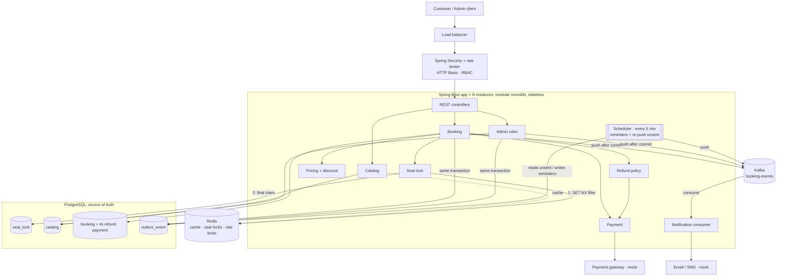
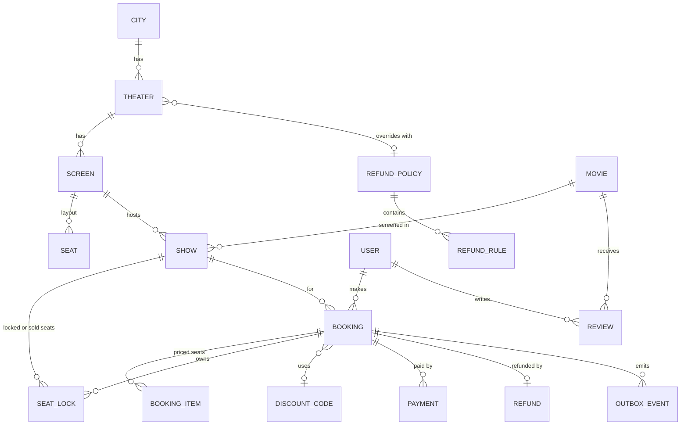
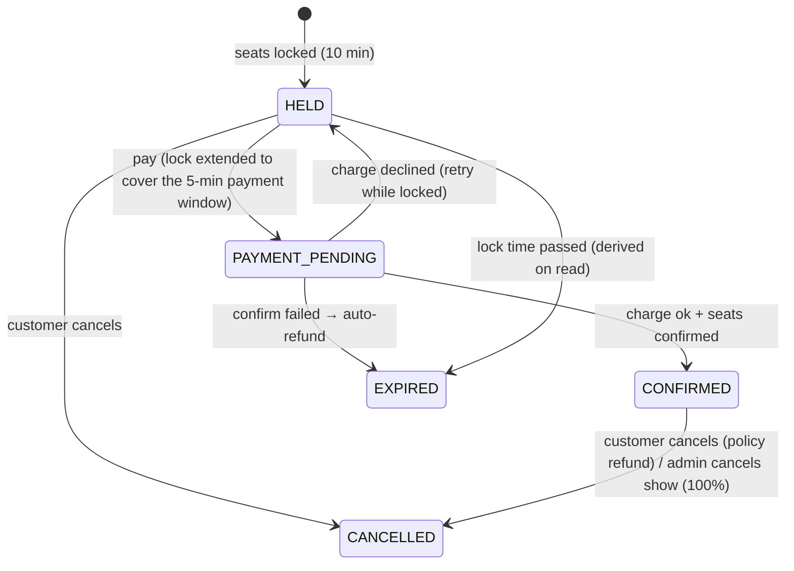
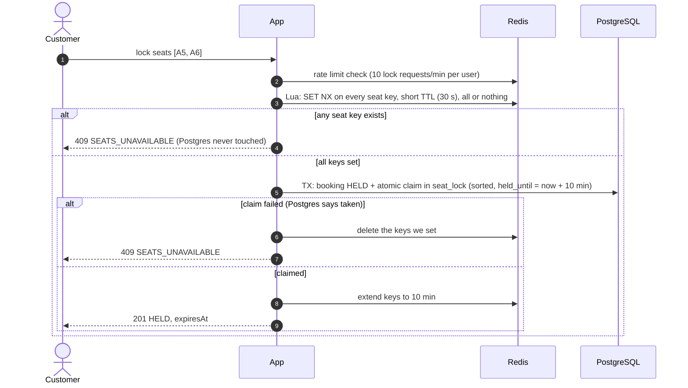

# High-Level Design — Movie Ticket Booking System

> This document covers **what** we build and **why**. Table columns, SQL, class names and API payloads are in [LLD.md](LLD.md).
> Constraints follow the reference design at [dev.to — Ticket Booking System (BookMyShow) HLD](https://dev.to/arghya_majumder/ticket-booking-system-bookmyshow-high-level-system-design-3one).
> **Diagram:** [HLD on Excalidraw](https://excalidraw.com/#json=o2eKJEHBE2mQhD0nls4W-,9Qe0FpP-GsHtyHzEGKnKww)

## 0. At a Glance

| Concern | Decision |
|---|---|
| Architecture | **Modular monolith** (Spring Boot 3, Java 21). **Stateless**; designed to run as N instances behind a load balancer. The take-home runs one. |
| Source of truth | **PostgreSQL** for all business data, including seat ownership |
| Seat locking | **Two layers:** a **Redis** atomic lock (`SET NX` + TTL) rejects contention in memory, and a **Postgres** `seat_lock` row (primary key per show + seat) is the final guarantee |
| Distributed cache | **Redis**: catalog, show listings, seat layouts, and a 2-second micro-cache of each show's seat map |
| Rate limiting | **Redis** counters per user: hold, pay and general requests |
| Redis failure | Circuit breaker → Postgres-only locking (slower, still correct); cache reads go to Postgres |
| Notifications | Event row saved in `outbox_event` (same transaction) → **pushed to Kafka right after commit** → notification consumer. `outbox_event` doubles as the **event audit log**. |
| Scheduled jobs | **One**, every 5 min: creates show reminders and re-pushes any event that didn't reach Kafka |
| Live seat map | Polling (5 s) with **ETag**; the hold response is the final answer |
| Payment | `PaymentGateway` interface (mock), idempotency key; payment window 5 min |
| Security | One login; HTTP Basic + BCrypt; roles `ADMIN` / `CUSTOMER`; ownership checks |
| Not used (by choice) | Elasticsearch, MongoDB, microservices (see §13) |

---

## 1. Problem Summary

A movie ticket booking platform across many **cities** and **theaters**. Each theater has **screens**, each screen runs **shows**, and customers book **individual seats**.

- Seats are locked for a limited time and released automatically if not booked.
- Pricing depends on seat type and on weekends; discount codes can be applied.
- Payment confirms a booking, and cancellation refunds according to configurable policies.
- When thousands of users try to book the same seats at the same time, **exactly one** gets each seat.
- Notifications must never block the booking flow.

**Out of scope (per brief):** UI, deployment/CI, microservices, OAuth/SSO/MFA, production observability.

---

## 2. Constraints and Assumptions

| Constraint | Value |
|---|---|
| Theaters / shows | **1,000+ theaters, 10,000+ shows per day** |
| Seats per show | **200–500** |
| Concurrency per show | **10,000 concurrent users** on a popular show |
| Peak concurrency | **100,000+ concurrent users** during new releases |
| Seat lock timeout | **10 minutes** |
| Payment window | **5 minutes** once payment starts (the lock is extended to cover it) |
| Availability | **99.9%** |
| Latency | Seat selection **< 200 ms**, booking **< 1 s** (excluding the external payment provider) |
| Consistency | **No double booking**, strongly consistent seat allocation |

---

## 3. Functional Requirements

### 3.1 Customer
| # | Requirement |
|---|---|
| C1 | Register and log in |
| C2 | Select a city and browse movies showing there, filtered by date, language and genre |
| C3 | View movie details (synopsis, duration, language, genres, certificate, cast, poster/trailer links) |
| C4 | List theaters and showtimes for a movie by date, optionally sorted by distance ("near me"), paginated |
| C5 | View a show's seat map: each seat's state (AVAILABLE / LOCKED / BOOKED), type and price |
| C6 | Lock 1–10 seats of a show, **all or nothing**; the lock expires automatically after 10 min |
| C7 | Apply a discount code and see the price breakdown |
| C8 | Pay for locked seats and receive confirmation |
| C9 | Cancel a booking and receive a refund according to the policy |
| C10 | View booking history, paginated |
| C11 | Receive confirmation, cancellation, refund and pre-show reminder notifications |

### 3.2 Admin
| # | Requirement |
|---|---|
| A1 | Manage cities, and theaters with address and coordinates |
| A2 | Manage screens and seat layouts (rows, numbers, seat type per seat) |
| A3 | Manage movies |
| A4 | Schedule shows; overlapping shows on a screen are rejected |
| A5 | Set each show's pricing: regular price, premium price and weekend multiplier |
| A6 | Manage discount codes: flat or percentage, cap, minimum order, validity, global and per-user limits |
| A7 | Manage refund policies: global default plus optional per-theater override |
| A8 | Cancel a show: full refund to every booking, customers notified |

---

## 4. Non-Functional Requirements

| Area | Target |
|---|---|
| **Correctness** | A seat is **never** sold twice. Seat booking and payment state are ACID in Postgres. |
| **Availability** | 99.9%. Under overload the booking path **rejects fast** (409/429/503) rather than risk overselling. |
| **Latency (p99)** | Seat map and seat lock < 200 ms · booking confirm < 1 s (plus the payment provider) |
| **Scalability** | 10K concurrent users per show, 100K+ platform-wide at release peaks; stateless app scales horizontally |
| **Fault tolerance** | Redis down → booking still correct (Postgres-only locking), browsing slower. Kafka down → bookings unaffected; events stay unsent in `outbox_event` and the scheduler re-pushes them. Email provider down → consumer retries, then dead-letter topic. |
| **Idempotency** | Payment is safe to retry; a double-click never charges twice. |
| **Notifications** | Asynchronous, at least once, retried; a failure never affects a booking. |
| **Fairness / abuse** | Per-user rate limits on locking and payment so bots can't hoard seats. |
| **Security** | RBAC; customers only see and change their own bookings; BCrypt passwords. |
| **Configurability** | Lock time, payment window, seat limit, rate limits, reminder lead time, pricing and refund rules change without code changes. |

### 4.1 System invariants (must always hold)

| Area | Invariant |
|---|---|
| Seat ownership | A seat for a show is AVAILABLE, LOCKED (by exactly one booking) or BOOKED, never two at once. |
| | A seat is only BOOKED if it was LOCKED by that same booking first. |
| | A lock always expires if it isn't converted into a booking. No seat stays blocked permanently. |
| Money | A booking is only CONFIRMED with a successful payment. |
| | One payment belongs to exactly one booking (idempotency key). |
| | Payment success never ends in a lost seat without a refund, or in a double booking. |
| Redis | **Redis never decides who owns a seat.** It only rejects requests early. |

### 4.2 Consistency model

| Domain | Consistency | Why |
|---|---|---|
| Seat locking and booking | **Strong** (Postgres) | No overselling |
| Payments | **Strong** | Financial correctness |
| Seat map display | Eventual (≤ ~2 s) | Small staleness is fine; the lock request re-checks |
| Show listings, catalog | Eventual (≤ 5 min) | Cached for performance |
| Notifications | Eventual | Must not block booking |

---

## 5. Capacity Estimates

| Metric | Estimate |
|---|---|
| Seats offered per day | 10K shows × ~350 seats ≈ **3.5M** |
| Bookings per day | ~2M tickets at ~2.5 seats per booking ≈ **~800K bookings/day** → ~10/s average |
| Bookings at peak | Bounded by seats: a hot show sells **at most 200–500 seats**, however many people try |
| Seat-map polls, hot show | 10K users × 1 poll per 5 s ≈ **2K requests/s per hot show** |
| Seat-map polls, platform peak | 100K users × 1 poll per 5 s ≈ **20K requests/s** |
| Lock attempts, hot show | Thousands per second in the first seconds of a release; **≥ 95% must fail** (10K users, ≤ 500 seats) |
| Redis capacity | 100K+ simple operations/s per node, far above these rates |

**What this means:**
- **Seat contention is the core problem.** Thousands of losing lock attempts per second on one show must be rejected **without touching Postgres**. That's the job of the **Redis lock layer**.
- **Seat-map polling must not hit Postgres per request.** A **2-second Redis micro-cache per show** turns 2K polls/s into at most one database query every 2 s per show.
- **Catalog browsing is read-heavy** and tolerates staleness, so it's served from the Redis cache.
- **No seat rows created in advance:** a `seat_lock` row exists only while a seat is locked or sold.

---

## 6. Architecture

### 6.1 Components



The diagram is on [Excalidraw](https://excalidraw.com/#json=o2eKJEHBE2mQhD0nls4W-,9Qe0FpP-GsHtyHzEGKnKww); every HLD / LLD diagram is also in [diagrams.html](diagrams.html).

### 6.2 Modules

| Module | Responsibility |
|---|---|
| **Security + rate limiter** | One login (HTTP Basic + BCrypt), roles, ownership checks. Per-user rate limits kept in Redis. |
| **Catalog** | Cities, theaters, screens and layouts, movies, shows. Browse, filters, "near me", pagination. Reads through the Redis cache. |
| **Admin rules** | Pricing, discount codes, refund policies; show cancellation (writes events like Booking does); clears affected cache entries on change. |
| **Booking** | Orchestrates lock → pay → confirm, and cancellation. Owns the booking lifecycle. |
| **Seat lock** | The two-layer lock: Redis filter, then the Postgres claim (§8). Behind an interface. |
| **Pricing + discount** | Price per seat; validates codes; counts usage atomically when paying. |
| **Refund policy** | Picks the applicable policy and computes the refund %. |
| **Payment** | Idempotent charge and refund through `PaymentGateway`. |
| **Notification consumer** | `@KafkaListener` on `booking-events`: renders and sends email/SMS; skips event IDs it has already handled. |

### 6.3 Background jobs

| Job | Every | Does |
|---|---|---|
| **Scheduler** (the only one) | 5 min | 1. **Reminders:** finds confirmed bookings whose show starts within 2 h and have no reminder yet → writes a `SHOW_REMINDER` row → pushes it to Kafka.<br>2. **Safety net:** finds `outbox_event` rows with no `sent_at`, older than 1 min (the push after commit failed) → pushes them again.<br>Both use `FOR UPDATE SKIP LOCKED`, so they're safe with several instances. |

There is **no lock cleanup job**:
- Redis keys expire through their TTL.
- A Postgres lock whose `held_until` has passed simply counts as free.
- An abandoned booking is reported as `EXPIRED` when read.

### 6.4 Deployment

| | Take-home | Production target |
|---|---|---|
| App | 1 instance | N stateless instances behind a load balancer (auto-scaling) |
| Postgres | 1 container | Primary + read replicas for catalog reads, via **PgBouncer** |
| Redis | 1 container | **Separate clusters for cache and for locks/rate limits** (§9.3), with replicas and Sentinel |
| Kafka | 1 broker (KRaft mode) | 3+ brokers, replication factor 3 |
| Edge | — | CDN for public catalog; **virtual waiting room** for release-day spikes |

The app keeps no state in memory (no sessions, no local cache), and lock times are compared against the database clock, so going from 1 to N instances needs no code change.

---

## 7. Domain Model

### 7.1 Entities



### 7.2 Booking lifecycle



### 7.3 Pricing, discounts, refunds
- **Price:** all pricing lives on the show: a **regular price**, a **premium price** and a **weekend multiplier** (default ×1.25). Seat price = its type's price × the weekend multiplier if the show starts on a Saturday or Sunday (IST). **Snapshotted** into the booking when seats are locked.
- **Discounts:** validated at lock time, **counted at payment** (atomically, before the charge), given back if the charge fails.
- **Refunds:** theater policy or global default; rules map hours-before-show to a %. Example: ≥ 24 h → 100%, 4–24 h → 50%, < 4 h → 0%. No cancellation after the show starts. Admin show cancellation → 100%.

---

## 8. Seat Locking (two layers)

### 8.1 Why two layers

| Layer | Job | If it fails |
|---|---|---|
| **Redis** (`SET NX` + TTL, per seat) | **Contention filter.** Rejects the thousands of losing clicks in memory, so Postgres sees roughly one attempt per seat. | Circuit breaker skips it → Postgres-only locking. Slower, still correct. |
| **Postgres** (`seat_lock`, primary key per show + seat, `held_until`) | **Source of truth.** Atomic claim; the only thing that decides ownership. Survives crashes. | — (it is the guarantee) |

Only a transactional database gives atomicity, durability and expiry together, so ownership lives in Postgres. Redis only protects Postgres from the thundering herd.

### 8.2 Lock flow



**Details that keep the two layers consistent:**

| Rule | Why |
|---|---|
| Redis keys are set **all or nothing** in one Lua script | No partial locks across seats |
| Keys start with a **short TTL (30 s)** and are extended to 10 min only **after** the Postgres commit | If the app crashes between Redis and Postgres, the ghost key disappears in 30 s |
| Key value = booking ID; extend and delete only if the value matches (Lua) | One user can never release or extend another user's lock |
| On **pay**: Postgres `held_until` and the Redis TTL are extended to cover the 5-minute payment window | The lock can't expire while the provider is processing |
| On **confirm**: the Postgres row becomes `booked`; the Redis key becomes a **"booked" marker** until the show ends | Later attempts on sold seats are rejected in memory too |
| On **cancel/expiry**: Postgres row deleted or simply out of date; Redis key deleted or expires | Seat becomes available again |
| If Redis and Postgres disagree, **Postgres wins** | A stale Redis key can only cause a false "taken" for ≤ its TTL; a missing key just lets the request reach Postgres, which decides correctly |

### 8.3 Postgres claim (the guarantee)

A `seat_lock` row exists only while a seat is locked or sold: `booked` (true/false) and `held_until`.

| `seat_lock` row | Seat state |
|---|---|
| none | AVAILABLE |
| booked = false, `held_until` in the future | LOCKED |
| booked = false, `held_until` in the past | AVAILABLE (expired; the next claim overwrites it) |
| booked = true | BOOKED |

The claim is one atomic insert-or-overwrite per seat that succeeds only if the seat has no row or an expired unbooked row. Seats are processed in **sorted order**, all in one transaction, so there are no partial locks and no deadlocks. Every time comparison uses the **database clock**.

### 8.4 Guarantees

| Mechanism | Protects against |
|---|---|
| Postgres primary key (show, seat) | Two owners for one seat, **even if Redis is wrong or down** |
| Redis `SET NX` filter | Thundering herd on hot seats reaching Postgres |
| Short initial Redis TTL | Ghost locks after a crash |
| Owner check on extend/release/confirm (both layers) | Releasing or taking over someone else's lock |
| Lock extension at payment start | Lock expiring mid-payment |
| Automatic refund if confirm fails | Money taken with no seat to show for it |
| Rate limits (Redis) | Bots hoarding seats; retry storms |
| Idempotency key on payment | Double charge |
| Max 10 seats per booking; one active lock per user per show | One user grabbing a whole show |

---

## 9. Redis Usage

### 9.1 What lives in Redis

| Use | Key pattern | TTL | Notes |
|---|---|---|---|
| **Seat lock filter** | `lock:{show:<id>}:seat:<seatId>` → bookingId | 30 s → 10 min (→ +payment window) | `{show:<id>}` hash tag keeps a show's keys on one cluster node, so multi-seat Lua scripts work in Redis Cluster |
| **Booked marker** | same key → `BOOKED` | until show end | Cheap rejection of sold seats |
| **Seat map micro-cache** | `seatmap:<showId>` → seat states + ETag | **2 s** | Collapses thousands of polls into one DB query per 2 s per show |
| **Movie details** | `movie:<id>` | 1 h | |
| **Theater info** | `theater:<id>` | 1 h | |
| **Show listings** | `shows:city:<c>:date:<d>:movie:<m>` | 5 min | |
| **Movies in a city** | `movies:city:<c>:date:<d>:<filters>` | 5 min | |
| **Seat layout** | `layout:<screenId>:v<version>` | 1 h | The version in the key means an edit never serves an old layout |
| **Rate limits** | `rl:<userId>:<endpoint>` | 60 s | Fixed-window counter (`INCR` + `EXPIRE`) |

**Never in Redis as truth:** seat ownership, bookings, payments, discount usage.

### 9.2 Cache patterns
- **Reads:** cache-aside (check Redis → on miss read Postgres → store with TTL).
- **Writes:** update Postgres first, then **evict** the affected keys (admin edits, show created or cancelled).

### 9.3 One Redis or two
Cache and locks need **different eviction policies**:
- A cache should evict old keys when memory is full (`allkeys-lru`).
- **Lock and rate-limit keys must never be evicted early** (`noeviction`).

In production these are **separate Redis clusters**. The take-home uses one Redis with `noeviction`, a TTL on every key, and enough memory.

### 9.4 Rate limits

| Endpoint | Limit |
|---|---|
| Lock seats | 10 / min per user |
| Pay | 5 / min per user |
| Everything else | 100 / min per user |

Exceeding a limit returns **429** with `Retry-After`. If Redis is unavailable, rate limiting fails **open**, so users aren't blocked.

### 9.5 When Redis is down
- A **circuit breaker** opens after repeated Redis errors:
  - Seat locking goes **straight to Postgres** (correct, slower).
  - Cache reads go to Postgres.
  - Rate limiting is skipped.
- When Redis recovers, the breaker closes. Seats locked meanwhile are still protected by Postgres; the Redis filter simply doesn't know about them yet, so those requests reach Postgres and are rejected there.

---

## 10. Main Flows

### 10.1 Book seats (end to end)
1. **Seat map:** served from the Redis micro-cache (≤ 2 s old) with an ETag; unchanged → 304.
2. **Lock:** rate limit → Redis filter → Postgres claim (§8.2) → 201 with `expiresAt` (10 min).
3. **Pay** (`Idempotency-Key`):
   - Extend the lock (Postgres + Redis) to cover the 5-minute payment window.
   - Count the discount; booking → `PAYMENT_PENDING`.
   - Charge the gateway, **outside** any database transaction.
4. **Confirm:** one transaction: seats booked, booking `CONFIRMED`, payment `SUCCESS`, `BOOKING_CONFIRMED` event row. After commit: push the event to Kafka; Redis keys become booked markers.

**Failure paths:**
- Lock expired before pay → 409, no charge.
- Card declined → back to `HELD`, discount given back, retry allowed while locked.
- Confirm fails after a charge → automatic refund, `EXPIRED`.

### 10.2 Cancel
- **Locked booking:** release both layers → `CANCELLED`.
- **Confirmed booking:** show not started → refund % from policy → refund via gateway → release both layers → `CANCELLED` + `BOOKING_CANCELLED` / `REFUND_PROCESSED` events.
- **Admin cancels a show:** show → `CANCELLED`; each booking refunded 100% in **its own transaction** (safe to re-run); all of the show's Redis keys and caches cleared.

### 10.3 Live seat map
- Clients **poll every 5 s** with `If-None-Match`.
- The ETag is a fingerprint of the taken seats plus the layout and price versions. It's computed when the micro-cache refreshes, so a lock expiring (which writes nothing) still changes it within 2 s.
- `nextChangeAt` tells the client when the next lock expires.
- **The lock response is the final answer:** a stale screen can't cause a wrong booking, because a conflicting lock returns 409 with the exact unavailable seats.
- *Production:* WebSocket or SSE push fed by Redis Pub/Sub, with polling as fallback.

---

## 11. Notifications: Event Log → Kafka → Consumer

```
Business TX:   state change + INSERT outbox_event (sent_at = NULL)   → COMMIT (both or neither)
After commit:  push event to Kafka "booking-events" → on ack: sent_at = now()
Scheduler (every 5 min):  create due reminders + re-push rows still unsent after 1 min
Notification consumer (@KafkaListener):  event → mark its row PROCESSED (skip if already) → email / SMS / push
```

### 11.1 The `outbox_event` table has two jobs
1. **Event audit log.** Every business event is recorded: what happened, for which booking or show, when it was created, and when it reached Kafka (`sent_at`). Rows are kept, not deleted; at scale the table is partitioned by month and old months are archived.
2. **Safety net.** A row with `sent_at = NULL` means the push to Kafka didn't succeed. The scheduler finds it and pushes it again.
3. **Delivery state.** One `status` column tracks each event end to end: `NOT_STARTED` → `IN_QUEUE` (Kafka acknowledged)
   → `PROCESSED` (the consumer handled it). The consumer's dedupe is this column, so no separate "processed events" table
   is needed. `FAILED` = gave up sending; `CANCELLED` = a reminder whose booking was cancelled.

### 11.2 Who does what

| Component | Responsible for |
|---|---|
| **Booking / Admin code** | Writes the event row **in the same transaction** as the change (booking confirmed or cancelled, refund, show cancelled). **Pushes it to Kafka right after commit** and sets `sent_at` when Kafka acknowledges. |
| **Scheduler** (every 5 min, the only scheduled job) | 1. **Reminders:** confirmed bookings whose show starts within 2 h and have no reminder yet → writes a `SHOW_REMINDER` row and pushes it.<br>2. **Re-push:** rows with `sent_at IS NULL` older than 1 min → pushes them again. |
| **Kafka** | Stores events once received (replicated); delivers them to consumers **in order per booking** (topic keyed by booking ID); retries failed processing (**retry topics**); sets aside events that keep failing (**dead-letter topic**). |
| **Notification consumer** | Marks the event row `PROCESSED` in the same transaction as the send, skipping it if it already is (at-least-once delivery), then sends email/SMS/push through `NotificationChannel`. Before sending a reminder, checks the booking is still confirmed and the show still scheduled. |

**The boundary:** before Kafka has an event, the event row and the scheduler guarantee it gets there. After Kafka has it, Kafka guarantees it's kept, delivered and retried.

### 11.3 Why save first, push after (never the other way round)

| Order | Failure | Result |
|---|---|---|
| **Save row + commit, then push** ✅ | App crashes or Kafka is unreachable before the push | Row has `sent_at = NULL` → scheduler re-pushes it within minutes. **Nothing lost.** |
| Push, then save / commit ❌ | Commit fails after the push | Customers are told "confirmed" or "show cancelled" for something that **didn't happen** |
| Push only, no row ❌ | App crashes between commit and push | Event lost for good. Kafka's replication can't help, because Kafka never received it. |

Kafka's durability starts **once Kafka acknowledges an event**. The saved row covers the moment before that.

### 11.4 Duplicates
Kafka delivers **at least once**. A duplicate can happen if:
- an event reached Kafka but `sent_at` wasn't saved before a crash, so the scheduler pushes it again, or
- the consumer sent the email but crashed before committing its Kafka offset.

The idempotent producer (`enable.idempotence=true`) prevents duplicates from simple network retries. Beyond that, the **consumer deduplicates by `eventId`** and passes it to the email/SMS provider as an idempotency key. Each customer gets one message.

**What Kafka adds:**
- **Several consumers of the same events.** Notification now; analytics and audit later, each its own consumer group, with no change to booking code.
- **Buffering** of release-day bursts.
- **Replay** of past events, for example after fixing a template bug.

**Load:** only successful actions create events, bounded by seats sold. That's ~20–30 events/s on an average day and a few hundred to ~1.5K/s at an extreme release peak. The 100K concurrent users mostly fail at the Redis lock and never create events.

| Event | Created when | Sent to |
|---|---|---|
| `BOOKING_CONFIRMED` | Payment succeeds | The customer |
| `BOOKING_CANCELLED` | Customer cancels | The customer |
| `REFUND_PROCESSED` | Refund goes through | The customer |
| `SHOW_CANCELLED` | Admin cancels a show | Every booked customer |
| `SHOW_REMINDER` | Scheduler, when the show is within 2 h | The customer |

The same pattern works for **Admin cancels a show**: in each booking's transaction, the booking is cancelled and a `SHOW_CANCELLED` row is written; after commit, the event is pushed to Kafka.


---

## 12. Browse, Search and Pagination
- **Movie → theaters → showtimes:** a structured filter (movie, city, date) served by indexed SQL behind the Redis cache.
- **"Near me":** scoped to a city; latitude/longitude box, then sort by distance. PostGIS later.
- **Pagination:** offset for bounded lists (movies, theaters, shows); cursor on (created_at, id) for booking history.
- **CDN readiness:** public catalog responses send `Cache-Control: public, max-age=60–300`; seat maps and personal data send `no-store`.

---

## 13. Considered and Rejected

| Option | For | Decision |
|---|---|---|
| **Redis as the only lock** (no Postgres claim) | Seat locking | ❌ A Redis failover can lose keys → double booking. Redis filters; Postgres decides. |
| **Postgres only** (no Redis layer) | Seat locking | ❌ at these constraints: thousands of losing clicks per second on one show would all hit Postgres. Kept as the **fallback** when Redis is down. |
| **Pessimistic lock** (`SELECT … FOR UPDATE`) | Seat locking | ❌ Lasts one transaction; can't span a 10-minute lock |
| **Optimistic lock** (`@Version`) | Seat locking | ❌ On hot shows most requests fail and retry |
| **Pre-created per-seat rows + cleanup job** | Availability | ❌ Rows only when locked/sold; expiry by timestamp, no job |
| **In-process cache (Caffeine)** | Caching | ❌ Not shared across instances |
| **Elasticsearch** | Search | ❌ now: structured filters are served by indexes + cache; add only for full-text title search at scale |
| **Push to Kafka with no event row** | Notifications | ❌ A crash between commit and push loses the event, and there's no audit trail (§11.3) |
| **Push to Kafka before the commit** | Notifications | ❌ Can announce a booking or cancellation that then rolls back (§11.3) |
| **A separate reminder job + a separate relay job** | Scheduling | ❌ One 5-minute scheduler handles both reminders and re-pushes |
| **Microservices** | Structure | ❌ Out of scope; clean module boundaries instead |

---

## 14. Scaling Path (documented, not built)

| Layer | Addition |
|---|---|
| **Edge** | CDN; **virtual waiting room** for releases (token-based queue, admitting e.g. a few thousand users per minute into seat selection); bot protection |
| **App** | N instances, auto-scaling behind the load balancer |
| **Postgres** | PgBouncer; read replicas for catalog; partition bookings by month; archive past shows |
| **Redis** | Separate clusters for cache and for locks; Redis Cluster sharded by show (hash-tagged keys already support it); Sentinel failover |
| **Live seat map** | WebSocket/SSE with Redis Pub/Sub |
| **Payment** | Gateway webhook decides the outcome; reconciliation job for stuck `PAYMENT_PENDING`; auto-refund of late payments |
| **Events** | More consumer groups (push, analytics, audit) on the same topic with no change to booking code; optionally **Debezium** (Kafka Connect) to publish `outbox_event` rows from Postgres's write-ahead log instead of pushing from the app |
| **Scheduled jobs** | ShedLock so one instance runs each job (rows are already safe through `SKIP LOCKED`) |
| **Security** | JWT/OAuth2 via an identity provider instead of HTTP Basic; role and ownership checks unchanged |

---

## 15. Security
- **One login** for customers and admins; the **role on the user** decides access. `GET /api/auth/me` returns the role so a frontend can show the right screens.
- Customers register themselves (always `CUSTOMER`). The admin account is seeded by migration.
- **Access rules:**
  - Browsing is public.
  - Booking needs a logged-in user.
  - `/api/admin/**` is `ADMIN` only; anyone else gets **403**.
- **Ownership:** someone else's booking → **404**, so booking IDs can't be probed.
- **Rate limits** per user (§9.4).
- **Stateless:** no server sessions, so no sticky sessions are needed.

---

## 16. Tech Stack

| Choice | Reason |
|---|---|
| Java 21 + Spring Boot 3 | Required stack |
| **PostgreSQL** + Spring Data JPA | Source of truth; atomic claims, conditional updates, `SKIP LOCKED` |
| Flyway | Versioned schema and seed data |
| HikariCP | Connection pool with a fast-fail timeout |
| **Redis** (Spring Data Redis, Lettuce) | Seat-lock filter (Lua scripts), distributed cache (Spring Cache), rate limiting |
| Resilience4j | Circuit breaker around Redis → Postgres-only fallback |
| Spring Security | One login, HTTP Basic, RBAC, ownership checks |
| Bean Validation + global error handler | Input validation and one error format |
| **Kafka** (KRaft) + Spring Kafka | `booking-events` topic; `@KafkaListener` consumer with retry topics and a dead-letter topic |
| `@Scheduled` | The single 5-minute scheduler: show reminders + re-push of unsent events |
| JUnit 5, Mockito, MockMvc | Unit and API tests |
| **Testcontainers** (PostgreSQL, Redis, Kafka) | Integration and **concurrency tests** on real infrastructure: 500 threads on one seat → exactly one winner; Redis stopped mid-test → still no double booking; Kafka stopped → bookings still succeed, events stay unsent, then the scheduler delivers them; duplicate event → one email |
| Docker Compose | Postgres + Redis + Kafka for local runs; not a deployment |

---

## 17. Key Assumptions
- Lock **10 min**; payment window **5 min** after payment starts; at most **10 seats** per booking; one active lock per customer per show.
- Reminder **2 h** before the show. All configurable.
- Show end = start + movie duration + 15 min cleaning buffer; used for overlap checks.
- One currency (INR), exact decimals; one time zone (IST); weekend = Saturday and Sunday.
- One discount code per booking.
- Payment gateway and notification channels are mocks behind interfaces.
