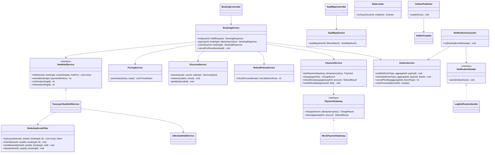
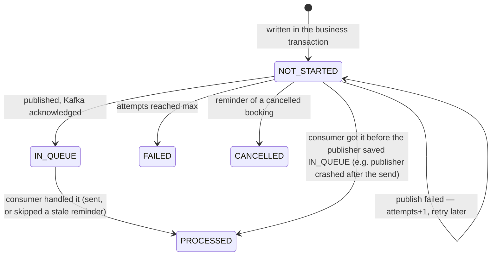

# Low-Level Design — Movie Ticket Booking System

> The **how**: packages, classes, schema, queries, transaction boundaries, API contracts and tests.
> The **what and why** is in [HLD.md](HLD.md). Section numbers here don't match the HLD's.
>
> **Design v2 (this document):**
> - Two-layer seat locking (Redis filter + Postgres claim), 10-min lock / 5-min payment window.
> - Redis rate limits and seat-map micro-cache.
> - Events: `outbox_event` → **outbox publisher → Kafka → notification consumer**, with reminders as future-dated outbox rows.
>
> The code implements v2. §18 lists the v1 → v2 changes and where each one lives. §19 is the scale and concurrency model,
> §20 the known gaps, §21 the demo and verification tools.
>
> **HLD diagram (Excalidraw):** [https://excalidraw.com/…](https://excalidraw.com/#json=o2eKJEHBE2mQhD0nls4W-,9Qe0FpP-GsHtyHzEGKnKww)

**Conventions**
- Base package `com.moviebooking`.
- Money is `BigDecimal` / `NUMERIC(10,2)`, rounded `HALF_UP`.
- Timestamps are `timestamptz`; business time zone is `Asia/Kolkata`.
- **Every seat-hold time comparison uses the database clock (`now()`)**, never the app clock.

---

## 1. Package Structure

Layer-first, each layer split by feature. Service interfaces are the public API of a feature; everything under
`internal` is private to it.

```
com.moviebooking
├── controller
│   ├── auth          AuthController
│   ├── catalog       BrowseController (public), AdminCatalogController, AdminShowController
│   ├── pricing       DiscountController, AdminPricingController
│   ├── refundpolicy  AdminRefundPolicyController
│   ├── booking       BookingController, SeatMapController, AdminBookingController, AdminRefundController
│   └── notification  AdminOutboxController
├── service
│   ├── auth          AppUserDetailsService                      └─ internal/ AppUserDetailsServiceImpl
│   ├── catalog       CityService, TheaterService, ScreenService, MovieService, ShowService, BrowseService,
│   │                 ShowUsageChecker (implemented by booking)   └─ internal/ …Impl
│   ├── pricing       PricingService, DiscountService, CheckoutPricing,
│   │                 DiscountUsage (implemented by booking)      └─ internal/ …Impl
│   ├── refundpolicy  RefundPolicyService                         └─ internal/ RefundPolicyServiceImpl
│   ├── booking       BookingService, BookingQueryService, SeatMapService
│   │   └── internal  …Impl, BookingNotifications, JdbcShowUsageChecker, JdbcDiscountUsage
│   │       └── seathold  SeatHoldService, TwoLayerSeatHoldService, RedisSeatLockFilter (layer 1),
│   │                     JdbcSeatHoldService (layer 2, the owner)
│   ├── payment       PaymentService, PaymentGateway              └─ internal/ PaymentServiceImpl, MockPaymentGateway
│   └── notification  OutboxService, NotificationSender
│       └── internal  OutboxServiceImpl, OutboxPublisher (@Scheduled → Kafka), NotificationConsumer (@KafkaListener),
│                     LogNotificationSender
├── repository/<feature>   UserRepository, City/Theater/Screen/Seat/Movie/ShowRepository, BookingRepository, …
├── model/<feature>        entities, enums, read models: User, Role, AppUserPrincipal · City … Show, ShowDetails, SeatLayout ·
│                          DiscountCode, PricedSeat, DiscountQuote · RefundPolicy, RefundRule (JSON value) ·
│                          Booking (+ its refund), BookingItem, BookingStatus · Payment (+ enums, RefundReason/RefundStatus) · OutboxEvent, EventType
├── dto/<feature>          request / response records; dto.notification.BookingEventMessage (Kafka message)
├── common            ApiError, ErrorCode, AppException, SeatsUnavailableException, GlobalExceptionHandler, DbClock,
│                     CursorCodec, PageResponse, SqlArrays, CurrentUser, RedisGuard (circuit breaker)
│   └── ratelimit     RateLimiter (Redis fixed window), RateLimitFilter
└── config            SecurityConfig, CacheConfig, CacheNames, RedisConfig (Lua scripts), KafkaConfig,
                      SchedulingConfig, AppProperties
```

**Rules**
- Dependencies point one way: controller → service interface → internal impl → repository / model.
  Model, DTO and repository never depend on service or controller.
- Nothing outside a feature's `internal` package may use it: controllers and other features depend on interfaces only.
- Controllers stay thin: validate, call one service, map to a DTO. Entities never leave the service layer.
- A module calls another module only through its service. No reaching into another module's repositories.
- Admin controllers are a separate entry point (`/api/admin/**`) onto the **same** services.

---

## 2. Class Diagram (core)



**Why interfaces here:**
- `SeatHoldService`: the booking code doesn't know there are two layers.
- `PaymentGateway`: swap in a real provider.
- `NotificationSender`: email, SMS, push.

`RateLimiter` is used by `RateLimitFilter` (a servlet filter after authentication), not by services.

---

## 3. Database Schema (PostgreSQL)

### 3.1 Flyway migrations

| File | Contents |
|---|---|
| `V1__users_and_catalog.sql` | `CREATE EXTENSION btree_gist`; `app_user`, `city`, `theater`, `screen`, `seat`, `movie`, `show` |
| `V2__pricing_discounts_refunds.sql` | `discount_code`, `refund_policy` (rules as a JSONB array; prices live on `show`) |
| `V3__booking_and_payment.sql` | `booking` (with its refund and `discount_redeemed`), `booking_item`, `seat_lock`, `payment` |
| `V4__outbox.sql` | `outbox_event` (status `NOT_STARTED → IN_QUEUE → PROCESSED`; also the consumer's dedupe) |
| `V5__seed_data.sql` | Admin and demo users, 2 cities, 3 theaters, screens with layouts, 4 movies, shows for the next 14 days (prices on each show), refund policies, sample discount codes |

**14 tables** (+ Flyway's history): `app_user`, `city`, `theater`, `screen`, `seat`, `movie`, `show`, `discount_code`,
`refund_policy`, `booking`, `booking_item`, `seat_lock`, `payment`, `outbox_event`.

| Folded away | Now | Why it's safe |
|---|---|---|
| `refund_rule` | `refund_policy.rules` JSONB `[{minHoursBefore, refundPercent}]` | Rules are always read and replaced as a whole with their policy; nothing queries one rule |
| `refund` | `booking.refund_*` columns | At most one refund per booking (was a unique FK anyway) |
| `discount_redemption` | `booking.discount_redeemed` | One code per booking; the per-user limit counts the customer's flagged bookings |
| `processed_event` | `outbox_event.status = PROCESSED` | One consumer group; marking the row is the dedupe |
| `review` | removed | Not in the brief's scope |

### 3.2 Tables

**Users and catalog**

```sql
CREATE TABLE app_user (
  id            BIGSERIAL PRIMARY KEY,
  email         VARCHAR(255) NOT NULL UNIQUE,          -- stored lower-case
  password_hash VARCHAR(100) NOT NULL,                 -- BCrypt
  full_name     VARCHAR(120) NOT NULL,
  role          VARCHAR(20)  NOT NULL CHECK (role IN ('ADMIN','CUSTOMER')),
  created_at    TIMESTAMPTZ  NOT NULL DEFAULT now()
);

CREATE TABLE city (
  id    BIGSERIAL PRIMARY KEY,
  name  VARCHAR(100) NOT NULL,
  state VARCHAR(100) NOT NULL,
  UNIQUE (name, state)
);

CREATE TABLE theater (
  id               BIGSERIAL PRIMARY KEY,
  city_id          BIGINT NOT NULL REFERENCES city(id),
  name             VARCHAR(150) NOT NULL,
  address          VARCHAR(300) NOT NULL,
  latitude         NUMERIC(9,6) NOT NULL CHECK (latitude  BETWEEN -90  AND 90),
  longitude        NUMERIC(9,6) NOT NULL CHECK (longitude BETWEEN -180 AND 180),
  refund_policy_id BIGINT NULL,                        -- FK added in V2
  active           BOOLEAN NOT NULL DEFAULT true
);
CREATE INDEX ix_theater_city   ON theater(city_id);
CREATE INDEX ix_theater_latlng ON theater(latitude, longitude);

CREATE TABLE screen (
  id             BIGSERIAL PRIMARY KEY,
  theater_id     BIGINT NOT NULL REFERENCES theater(id),
  name           VARCHAR(50) NOT NULL,
  layout_version INT NOT NULL DEFAULT 1,               -- +1 on every layout change (part of the ETag)
  UNIQUE (theater_id, name)
);

CREATE TABLE seat (
  id          BIGSERIAL PRIMARY KEY,
  screen_id   BIGINT NOT NULL REFERENCES screen(id),
  row_label   VARCHAR(3) NOT NULL,
  seat_number INT NOT NULL CHECK (seat_number > 0),
  seat_type   VARCHAR(10) NOT NULL CHECK (seat_type IN ('REGULAR','PREMIUM')),
  active      BOOLEAN NOT NULL DEFAULT true,           -- false = broken / removed
  UNIQUE (screen_id, row_label, seat_number)
);
CREATE INDEX ix_seat_screen ON seat(screen_id);

CREATE TABLE movie (
  id               BIGSERIAL PRIMARY KEY,
  title            VARCHAR(200) NOT NULL,
  description      TEXT,
  duration_minutes INT NOT NULL CHECK (duration_minutes BETWEEN 1 AND 600),
  language         VARCHAR(30) NOT NULL,
  genres           VARCHAR(200) NOT NULL,              -- comma-separated, e.g. "Action,Sci-Fi"
  certificate      VARCHAR(5)  NOT NULL CHECK (certificate IN ('U','UA','A')),
  release_date     DATE NOT NULL,
  cast_members     TEXT,
  poster_url       VARCHAR(500),
  trailer_url      VARCHAR(500)
);

CREATE TABLE show (
  id          BIGSERIAL PRIMARY KEY,
  movie_id    BIGINT NOT NULL REFERENCES movie(id),
  screen_id   BIGINT NOT NULL REFERENCES screen(id),
  start_time  TIMESTAMPTZ NOT NULL,
  end_time    TIMESTAMPTZ NOT NULL,                    -- start + duration + cleaning buffer
  regular_price      NUMERIC(10,2) NOT NULL CHECK (regular_price > 0),              -- REGULAR seat
  premium_price      NUMERIC(10,2) NOT NULL CHECK (premium_price > 0),              -- PREMIUM seat
  weekend_multiplier NUMERIC(4,2)  NOT NULL DEFAULT 1.25 CHECK (weekend_multiplier > 0), -- Sat/Sun (IST)
  status      VARCHAR(15) NOT NULL DEFAULT 'SCHEDULED' CHECK (status IN ('SCHEDULED','CANCELLED')),
  version     INT NOT NULL DEFAULT 0,                  -- +1 on any admin edit (part of the ETag)
  CHECK (end_time > start_time),
  -- no two scheduled shows overlap on one screen, even under concurrent admin requests
  CONSTRAINT ex_show_no_overlap EXCLUDE USING gist
    (screen_id WITH =, tstzrange(start_time, end_time) WITH &&) WHERE (status = 'SCHEDULED')
);
CREATE INDEX ix_show_movie_start ON show(movie_id, start_time);
CREATE INDEX ix_show_screen      ON show(screen_id);
```

**Pricing, discounts and refund policies**

```sql
CREATE TABLE discount_code (
  id             BIGSERIAL PRIMARY KEY,
  code           VARCHAR(30) NOT NULL UNIQUE,          -- stored upper-case
  type           VARCHAR(10) NOT NULL CHECK (type IN ('FLAT','PERCENT')),
  value          NUMERIC(10,2) NOT NULL CHECK (value > 0),
  max_discount   NUMERIC(10,2) NULL,                   -- cap for PERCENT
  min_order      NUMERIC(10,2) NOT NULL DEFAULT 0,
  valid_from     TIMESTAMPTZ NOT NULL,
  valid_to       TIMESTAMPTZ NOT NULL,
  usage_limit    INT NULL,                             -- NULL = unlimited
  used_count     INT NOT NULL DEFAULT 0,
  per_user_limit INT NOT NULL DEFAULT 1,
  active         BOOLEAN NOT NULL DEFAULT true,
  CHECK (type <> 'PERCENT' OR value <= 100),
  CHECK (usage_limit IS NULL OR used_count <= usage_limit),
  CHECK (valid_to > valid_from)
);

-- rules: JSON array of {"minHoursBefore": 24, "refundPercent": 100}; the app validates them
-- (0-100 %, distinct thresholds, one rule at 0 h) and keeps them sorted, highest threshold first
CREATE TABLE refund_policy (
  id         BIGSERIAL PRIMARY KEY,
  name       VARCHAR(100) NOT NULL,
  is_default BOOLEAN NOT NULL DEFAULT false,
  rules      JSONB NOT NULL CHECK (jsonb_typeof(rules) = 'array')
);
CREATE UNIQUE INDEX ux_refund_policy_default ON refund_policy(is_default) WHERE is_default;

ALTER TABLE theater ADD CONSTRAINT fk_theater_policy
  FOREIGN KEY (refund_policy_id) REFERENCES refund_policy(id);
```

**Booking, seat locks and payments**

```sql
CREATE TABLE booking (
  id               BIGSERIAL PRIMARY KEY,
  user_id          BIGINT NOT NULL REFERENCES app_user(id),
  show_id          BIGINT NOT NULL REFERENCES show(id),
  status           VARCHAR(20) NOT NULL
                   CHECK (status IN ('HELD','PAYMENT_PENDING','CONFIRMED','CANCELLED','EXPIRED')),
  subtotal         NUMERIC(10,2) NOT NULL,
  discount_amount  NUMERIC(10,2) NOT NULL DEFAULT 0,
  total_amount     NUMERIC(10,2) NOT NULL,
  discount_code_id BIGINT NULL REFERENCES discount_code(id),
  discount_redeemed BOOLEAN NOT NULL DEFAULT false,      -- the code's use was counted at payment
  hold_expires_at  TIMESTAMPTZ NOT NULL,
  -- refund: at most one per booking, so it lives on the booking (all NULL = no refund)
  refund_amount      NUMERIC(10,2),
  refund_percent     INT CHECK (refund_percent BETWEEN 0 AND 100),
  refund_reason      VARCHAR(20) CHECK (refund_reason IN ('CUSTOMER_CANCEL','SHOW_CANCELLED','CONFIRM_FAILED')),
  refund_status      VARCHAR(10) CHECK (refund_status IN ('PENDING','SUCCESS','FAILED')),
  refund_gateway_ref VARCHAR(100),
  refunded_at        TIMESTAMPTZ,
  created_at       TIMESTAMPTZ NOT NULL DEFAULT now(),
  updated_at       TIMESTAMPTZ NOT NULL DEFAULT now()
);
-- one active hold per customer per show (also blocks double-click duplicates)
CREATE UNIQUE INDEX ux_booking_active_hold ON booking(user_id, show_id)
  WHERE status IN ('HELD','PAYMENT_PENDING');
CREATE INDEX ix_booking_user_created ON booking(user_id, created_at DESC, id DESC);  -- history cursor
CREATE INDEX ix_booking_show_status  ON booking(show_id, status);
CREATE INDEX ix_booking_discount_use ON booking(discount_code_id, user_id) WHERE discount_redeemed;  -- per-user limit
CREATE INDEX ix_booking_refund       ON booking(refund_status) WHERE refund_status IS NOT NULL;     -- admin refund list
-- booking id is taken with nextval('booking_id_seq') *before* the Redis filter,
-- so the Redis lock value and the booking row share one id (§6.1)

CREATE TABLE booking_item (                            -- immutable price snapshot
  id         BIGSERIAL PRIMARY KEY,
  booking_id BIGINT NOT NULL REFERENCES booking(id),
  seat_id    BIGINT NOT NULL REFERENCES seat(id),
  seat_label VARCHAR(10) NOT NULL,                     -- e.g. "A5"
  seat_type  VARCHAR(10) NOT NULL,
  price      NUMERIC(10,2) NOT NULL,
  UNIQUE (booking_id, seat_id)
);

CREATE TABLE seat_lock (                               -- rows exist only for held or sold seats
  show_id    BIGINT NOT NULL REFERENCES show(id),
  seat_id    BIGINT NOT NULL REFERENCES seat(id),
  booking_id BIGINT NOT NULL REFERENCES booking(id),
  booked     BOOLEAN NOT NULL DEFAULT false,
  held_until TIMESTAMPTZ NOT NULL,
  PRIMARY KEY (show_id, seat_id)                       -- the double-booking guard
);
CREATE INDEX ix_seat_lock_booking ON seat_lock(booking_id);

CREATE TABLE payment (
  id              BIGSERIAL PRIMARY KEY,
  booking_id      BIGINT NOT NULL REFERENCES booking(id),
  amount          NUMERIC(10,2) NOT NULL,
  status          VARCHAR(20) NOT NULL
                  CHECK (status IN ('PENDING','SUCCESS','FAILED','REFUNDED','PARTIALLY_REFUNDED')),
  idempotency_key VARCHAR(64) NOT NULL UNIQUE,
  gateway_ref     VARCHAR(100),
  failure_reason  VARCHAR(200),
  created_at      TIMESTAMPTZ NOT NULL DEFAULT now(),
  updated_at      TIMESTAMPTZ NOT NULL DEFAULT now()
);
CREATE INDEX ix_payment_booking ON payment(booking_id);
```

**Outbox (event log, delivery state and consumer dedupe)**

```sql
CREATE TABLE outbox_event (                            -- every business event; also the audit log
  id              BIGSERIAL PRIMARY KEY,               -- = eventId everywhere (Kafka message, consumer dedupe)
  event_type      VARCHAR(40) NOT NULL,
  aggregate_id    BIGINT NOT NULL,                     -- booking id (Kafka key → per-booking order)
  payload         JSONB NOT NULL,                      -- everything needed to render the message
  status          VARCHAR(12) NOT NULL DEFAULT 'NOT_STARTED'
                  CHECK (status IN ('NOT_STARTED','IN_QUEUE','PROCESSED','FAILED','CANCELLED')),
  attempts        INT NOT NULL DEFAULT 0,
  next_attempt_at TIMESTAMPTZ NOT NULL DEFAULT now(),  -- now for normal events; show start − 2 h for reminders
  last_error      VARCHAR(500),
  created_at      TIMESTAMPTZ NOT NULL DEFAULT now(),
  sent_at         TIMESTAMPTZ,                         -- Kafka acknowledged (→ IN_QUEUE)
  processed_at    TIMESTAMPTZ                          -- consumer finished (→ PROCESSED)
);
CREATE INDEX ix_outbox_due       ON outbox_event(next_attempt_at) WHERE status = 'NOT_STARTED';
CREATE INDEX ix_outbox_aggregate ON outbox_event(aggregate_id, event_type);   -- cancel a booking's reminder
```
Rows are kept as audit history. At scale, partition `outbox_event` by month and archive old partitions.

### 3.3 Constraints as the last line of defence

| Rule | Enforced by |
|---|---|
| One owner per seat per show | `seat_lock` primary key |
| No overlapping shows on a screen | `ex_show_no_overlap` exclusion constraint |
| One active hold per user per show | `ux_booking_active_hold` partial unique index |
| No double charge | `payment.idempotency_key` unique |
| Discount usage limit | `CHECK used_count <= usage_limit` + conditional update |
| One refund per booking | refund columns live on the booking row |
| One default refund policy | `ux_refund_policy_default` partial unique index |
| Per-user discount limit | conditional `used_count` update locks the code's row, then counts `booking.discount_redeemed` |
| An event handled once | `UPDATE outbox_event SET status='PROCESSED' … WHERE status NOT IN ('PROCESSED','CANCELLED')` in the send's transaction |

Services check these rules first so they can return friendly errors. The constraints catch whatever gets past the checks under concurrency.

---

## 4. Enums and State Machines

| Enum | Values |
|---|---|
| `Role` | `ADMIN`, `CUSTOMER` |
| `SeatType` | `REGULAR`, `PREMIUM` |
| `ShowStatus` | `SCHEDULED`, `CANCELLED` |
| `BookingStatus` | `HELD`, `PAYMENT_PENDING`, `CONFIRMED`, `CANCELLED`, `EXPIRED` |
| `PaymentStatus` | `PENDING`, `SUCCESS`, `FAILED`, `REFUNDED`, `PARTIALLY_REFUNDED` |
| `RefundStatus` | `PENDING`, `SUCCESS`, `FAILED` |
| `RefundReason` | `CUSTOMER_CANCEL`, `SHOW_CANCELLED`, `CONFIRM_FAILED` |
| `DiscountType` | `FLAT`, `PERCENT` |
| `OutboxStatus` | `NOT_STARTED`, `IN_QUEUE`, `PROCESSED`, `FAILED`, `CANCELLED` |
| `EventType` | `BOOKING_CONFIRMED`, `BOOKING_CANCELLED`, `REFUND_PROCESSED`, `SHOW_CANCELLED`, `SHOW_REMINDER` |

### 4.1 Booking

```mermaid
stateDiagram-v2
    [*] --> HELD : hold()
    HELD --> PAYMENT_PENDING : pay() — hold extended, discount counted
    PAYMENT_PENDING --> CONFIRMED : charge ok + seats confirmed
    PAYMENT_PENDING --> HELD : charge declined — discount given back
    PAYMENT_PENDING --> EXPIRED : confirm failed — auto-refund
    HELD --> EXPIRED : hold_expires_at passed (derived; saved when touched)
    HELD --> CANCELLED : cancel()
    CONFIRMED --> CANCELLED : cancel() / admin cancels show
```



**Effective status:** `BookingStatus effective(Booking b, Instant dbNow)` returns `EXPIRED` when `status == HELD && hold_expires_at <= dbNow`, otherwise the stored status. Every response uses it.

A stale `HELD` row is saved as `EXPIRED`:
- when the same user holds again for that show (it would block `ux_booking_active_hold`),
- on `pay()` or `cancel()`,
- when an admin cancels the show.

### 4.2 Outbox event



`IN_QUEUE` means **Kafka has it**; `PROCESSED` means the consumer is done. A redelivered message finds its row already
`PROCESSED` and is skipped. If sending fails, the consumer's transaction rolls back, the row stays `IN_QUEUE`, and Kafka
retries (§10.4).

---

## 5. Seat Locks — two layers (`TwoLayerSeatHoldService`)

| Layer | Class | Role | When it fails |
|---|---|---|---|
| 1 | `RedisSeatLockFilter` | **Contention filter.** Rejects losing clicks in memory so Postgres sees about one attempt per seat. | Circuit breaker open → layer skipped |
| 2 | `JdbcSeatHoldService` | **Owner.** Atomic claim in `seat_lock`; the only thing that decides who holds a seat. | — |

**Rule:** if the two layers disagree, Postgres wins. Redis state can only cause a false "taken" (bounded by the key's TTL) or let a request through to Postgres, which decides correctly.

### 5.1 Layer 1 — Redis filter

**Keys:** `lock:{show:<showId>}:seat:<seatId>` → value `<bookingId>` or `BOOKED`.
The `{show:<id>}` hash tag puts all of a show's keys in one Redis Cluster slot, so the multi-key Lua scripts below work in cluster mode.

**Scripts** (loaded once in `RedisConfig`, run with `EVALSHA`):

```lua
-- ACQUIRE_ALL: all or nothing. KEYS = seat keys, ARGV[1] = bookingId, ARGV[2] = ttlMs
local taken = {}
for i, k in ipairs(KEYS) do
  if redis.call('EXISTS', k) == 1 then taken[#taken + 1] = i end
end
if #taken > 0 then return taken end               -- caller maps indexes → seat ids → 409
for _, k in ipairs(KEYS) do redis.call('SET', k, ARGV[1], 'PX', ARGV[2]) end
return {}

-- EXTEND_IF_OWNER: ARGV[1] = bookingId, ARGV[2] = ttlMs
for _, k in ipairs(KEYS) do
  if redis.call('GET', k) == ARGV[1] then redis.call('PEXPIRE', k, ARGV[2]) end
end

-- RELEASE_IF_OWNER: ARGV[1] = bookingId
for _, k in ipairs(KEYS) do
  if redis.call('GET', k) == ARGV[1] then redis.call('DEL', k) end
end

-- MARK_BOOKED: ARGV[1] = bookingId, ARGV[2] = show end (epoch ms)
for _, k in ipairs(KEYS) do
  local v = redis.call('GET', k)
  if v == false or v == ARGV[1] then redis.call('SET', k, 'BOOKED', 'PXAT', ARGV[2]) end
end
```

**TTL sequence:**

| Step | Redis TTL | Why |
|---|---|---|
| `tryAcquire` before the Postgres transaction | **30 s** (`app.seat-lock.redis-initial-ttl`) | If the app dies before the Postgres commit, the ghost key vanishes within 30 s |
| After the Postgres claim commits | extend to **hold duration (10 min)** | Matches `held_until` |
| On pay | extend to **`held_until − now`** (≥ 5-min payment window) | Matches the extended Postgres lock |
| After confirm commits | `BOOKED` until **show end** | Later attempts on sold seats rejected in memory |
| Cancel / expiry / confirm failure | delete (owner-checked) or let the TTL expire | Seat available again |

All Redis calls **after** a Postgres commit are best effort. A failure there is logged and never undoes the committed state.

**Circuit breaker** (Resilience4j, named `redis`):
- Opens after 50% of calls fail within a 20-call window, or when calls exceed 200 ms. It stays open for 10 s.
- While open, `RedisSeatLockFilter` returns "not taken" without calling Redis, and `JdbcSeatHoldService` runs its **cheap check** (§5.2) instead. Locking stays correct and only gets slower.

### 5.2 Layer 2 — Postgres claim (`JdbcSeatHoldService`)

Implemented with `NamedParameterJdbcTemplate`, using native SQL for full control. Every method runs inside the caller's transaction (`@Transactional(propagation = MANDATORY)`).

**Hold — all seats or none**

```sql
-- :seatIds is sorted ascending in Java before the call: a consistent lock order prevents deadlocks
INSERT INTO seat_lock AS s (show_id, seat_id, booking_id, booked, held_until)
SELECT :showId, x.seat_id, :bookingId, false, now() + CAST(:holdFor AS interval)
FROM unnest(CAST(:seatIds AS bigint[])) WITH ORDINALITY AS x(seat_id, ord)
ORDER BY x.ord
ON CONFLICT (show_id, seat_id) DO UPDATE
   SET booking_id = EXCLUDED.booking_id,
       held_until = EXCLUDED.held_until
 WHERE NOT s.booked AND s.held_until <= now()          -- only overwrite an expired hold
RETURNING seat_id;
```
- **Returned IDs = requested:** success.
- **Fewer:** the caller throws `SeatsUnavailableException(requested − returned)`, and the whole transaction, including the booking row, rolls back.

**Cheap check** (no locks). Only needed **when the Redis layer is bypassed**; with Redis up, layer 1 already did this job:
```sql
SELECT seat_id FROM seat_lock
WHERE show_id = :showId AND seat_id = ANY(:seatIds) AND (booked OR held_until > now());
```

**Extend, confirm, release**

```sql
-- extend (on pay): only if this booking still owns every seat and the hold is valid;
-- guarantees at least the payment window (5 min) is left
UPDATE seat_lock SET held_until = GREATEST(held_until, now() + CAST(:paymentWindow AS interval))
WHERE booking_id = :bookingId AND NOT booked AND held_until > now()
RETURNING held_until;                                                     -- rows must = seat count

-- confirm (same transaction as booking → CONFIRMED)
UPDATE seat_lock SET booked = true
WHERE booking_id = :bookingId AND NOT booked AND held_until > now();      -- rows must = seat count

-- release (cancel / expire / show cancelled): only rows this booking still owns
DELETE FROM seat_lock WHERE booking_id = :bookingId;
```

`WHERE booking_id = :bookingId` is the ownership check. If a hold expired and someone else took the seat, the row now carries *their* booking ID, so these statements can't touch it.

---

## 6. Booking Service — flows and transaction boundaries

The payment gateway is called **outside** any database transaction, so row locks are never held during a network call. The service uses `TransactionTemplate` to open the short transactions explicitly.

### 6.1 `hold(userId, HoldRequest{showId, seatIds, discountCode?})`

```
RateLimitFilter: 10 hold requests / min / user                               → 429 RATE_LIMITED
validate: 1 ≤ seatIds ≤ maxSeats (10), no duplicates; sort seatIds
bookingId ← SELECT nextval('booking_id_seq')          // one id for the Redis value and the booking row

LAYER 1 (no transaction):
  taken ← redisFilter.tryAcquire(showId, seatIds, bookingId, ttl = 30 s)
  taken non-empty                                                            → 409 SEATS_UNAVAILABLE(taken)
                                                                               (Postgres never touched)
LAYER 2 — TX:
  dbNow ← SELECT now()
  show  ← showRepo.find(showId) FOR SHARE   404 SHOW_NOT_FOUND
  require show.status = SCHEDULED and show.start_time > dbNow                → 409 SHOW_NOT_BOOKABLE
  seats ← seatRepo.findActive(seatIds, show.screenId); size must match       → 400 INVALID_SEATS
  expireStaleHold(userId, showId, dbNow)   // HELD + hold_expires_at ≤ now → EXPIRED, release its seat_lock rows
  if redis layer bypassed: taken ← seatHold.cheapCheck(...) → 409 if non-empty
  priced ← pricingService.priceSeats(show, seats)
  quote  ← discountCode ? discountService.preview(code, userId, subtotal) : none  // validate only, no counting
  booking ← insert (id = bookingId) HELD, amounts, hold_expires_at = dbNow + holdFor (10 min)
            (unique violation on ux_booking_active_hold                      → 409 ACTIVE_HOLD_EXISTS)
  insert booking_items (price snapshot)
  claimed ← jdbcHold.hold(showId, bookingId, seatIds, holdFor)
  claimed.size < seatIds.size → throw SeatsUnavailable(seatIds − claimed)    → 409, full rollback

on rollback / any exception:  redisFilter.release(showId, seatIds, bookingId)   // best effort
after commit:                 redisFilter.extend(showId, seatIds, bookingId, holdFor)
                              evict seatmap:<showId> micro-cache
return 201 BookingResponse
```

### 6.2 `pay(userId, bookingId, idempotencyKey)`

```
existing ← paymentRepo.findByIdempotencyKey(key)
  same booking      → return current booking state (safe replay, no second charge)
  different booking → 409 IDEMPOTENCY_KEY_REUSED

RateLimitFilter: 5 pay requests / min / user                           → 429 RATE_LIMITED

TX1 (prepare):
  booking ← SELECT … FOR UPDATE WHERE id AND user_id                    404 BOOKING_NOT_FOUND
  status ≠ HELD                          → 409 INVALID_BOOKING_STATE
  hold_expires_at ≤ now → EXPIRED + release seats                      → 409 HOLD_EXPIRED
  heldUntil ← jdbcHold.extend(booking.id, paymentWindow = 5 min); rows ≠ seat count → 409 HOLD_EXPIRED
  booking.hold_expires_at = heldUntil
  if discount: discountService.redeem(codeId, userId); booking.discount_redeemed = true   → 422 INVALID_DISCOUNT (no charge)
  booking.status = PAYMENT_PENDING
  payment ← insert PENDING(amount, idempotencyKey)   (unique race on key → treat as replay)

after TX1:  redisFilter.extend(showId, seatIds, booking.id, heldUntil − now)   // best effort

charge ← gateway.charge(total, idempotencyKey)       // no transaction open

declined:
  TX: payment FAILED(reason); booking HELD; if discount_redeemed: giveBack(codeId), discount_redeemed = false
  → 402 PAYMENT_FAILED (retry allowed while the hold is valid)

approved:
  TX2 (confirm):
    jdbcHold.confirm(booking.id) ≠ seat count → throw ConfirmFailed (rolls back TX2)
    booking CONFIRMED; payment SUCCESS(gateway_ref)
    outbox.publish(BOOKING_CONFIRMED, booking.id, payload)                     // due now
    if show.start_time − reminderLead > now:
      outbox.schedule(SHOW_REMINDER, booking.id, payload, dueAt = show.start_time − 2 h)
  after TX2: redisFilter.markBooked(showId, seatIds, booking.id, until = show.end_time); evict seatmap
  → 200 BookingResponse

ConfirmFailed (TX2 rolled back; money was taken):
  gateway.refund(gateway_ref, total)
  TX3: payment REFUNDED; booking.refund_* = (total, 100 %, CONFIRM_FAILED, SUCCESS); booking EXPIRED;
       give the discount back; jdbcHold.release; outbox.publish(REFUND_PROCESSED)
  after TX3: redisFilter.release(showId, seatIds, booking.id)
  → 409 HOLD_EXPIRED ("payment refunded")
```

A booking made less than 2 h before the show gets **no reminder row**, because the confirmation email is enough.

**Known gap (documented):** if the app crashes between the charge and TX2, the booking stays `PAYMENT_PENDING` with a `PENDING` payment. The mock gateway can't cause this. In production, a reconciliation job queries the gateway by idempotency key and either confirms or refunds (HLD scaling path).

### 6.3 `cancel(userId, bookingId)`

```
TX1:
  booking ← SELECT … FOR UPDATE WHERE id AND user_id                    404
  effective status:
    HELD            → jdbcHold.release; CANCELLED; after commit redisFilter.release; return   (no money involved)
    PAYMENT_PENDING → 409 PAYMENT_IN_PROGRESS
    EXPIRED / CANCELLED → 409 INVALID_BOOKING_STATE
    CONFIRMED:
      show.start_time ≤ now → 422 CANCELLATION_NOT_ALLOWED
      pct    ← refundPolicyService.refundPercent(theater, hoursUntil(show.start_time))
      amount ← total × pct / 100 (HALF_UP)
      jdbcHold.release; booking CANCELLED
      booking.refund_* ← (amount, pct, CUSTOMER_CANCEL, PENDING)   (amount 0 → SUCCESS right away)
      outbox.publish(BOOKING_CANCELLED, …)
      outbox.cancelPending(booking.id, SHOW_REMINDER)       // no reminder for a cancelled booking
after TX1: redisFilter.release(...)  (deletes the BOOKED markers too); evict seatmap
if amount > 0:
  result ← gateway.refund(payment.gateway_ref, amount)
  TX2: booking.refund_status SUCCESS/FAILED (+ refund_gateway_ref, refunded_at); payment REFUNDED or PARTIALLY_REFUNDED;
       on SUCCESS outbox.publish(REFUND_PROCESSED, …)
```

A refund that fails stays `PENDING`/`FAILED` on the booking and is visible to admins (`GET /admin/refunds?status=FAILED`). Automatic retry is on the scaling path.

### 6.4 Admin `cancelShow(showId)`

```
TX: show ← FOR UPDATE; already CANCELLED → return (idempotent); status CANCELLED; version+1
ids ← bookings of show with status IN (HELD, PAYMENT_PENDING, CONFIRMED)
for each id: bookingService.cancelForShow(id)     // its own transaction; one failure doesn't stop the rest
  HELD / PAYMENT_PENDING → release seats, CANCELLED (a PAYMENT_PENDING confirm then fails → auto-refund)
  CONFIRMED → same as §6.3 with pct = 100, reason SHOW_CANCELLED, event SHOW_CANCELLED
              (its pending SHOW_REMINDER row is cancelled in the same transaction)
delete Redis keys lock:{show:<id>}:* (iterate the screen's seat ids; one slot, so one pipeline)
evict caches: showsForMovie, moviesInCity, seatmap:<showId>
```

Running it again only processes bookings that aren't cancelled yet.

**Show time changes** are only allowed while a show has no bookings (§7.5), so no scheduled reminder ever needs moving.

---

## 7. Business Rules

### 7.1 Pricing — `PricingService`
```java
BigDecimal seatPrice(Show show, SeatType type) {
    BigDecimal seatTypePrice = type == PREMIUM ? show.premiumPrice() : show.regularPrice();
    DayOfWeek day = show.startTime().atZone(IST).getDayOfWeek();
    BigDecimal weekend = (day == SATURDAY || day == SUNDAY) ? show.weekendMultiplier() : ONE;
    return seatTypePrice.multiply(weekend).setScale(2, HALF_UP);
}
```
- All pricing lives on the show: `regular_price`, `premium_price`, `weekend_multiplier` (a new show without one gets
  `app.show.default-weekend-multiplier`, 1.25). There is no global pricing table.
- The weekend multiplier applies on top of both. The result is snapshotted into `booking_item.price` at lock time.

### 7.2 Discounts — `DiscountService`
**Preview (at hold, no counting).** The code must be `active`, `valid_from ≤ now < valid_to`, and `subtotal ≥ min_order`; otherwise 422 `INVALID_DISCOUNT`.
```
FLAT    → discount = min(value, subtotal)
PERCENT → discount = min(subtotal × value / 100, max_discount ?: ∞)   (HALF_UP)
total   = subtotal − discount   (≥ 0)
```
**Redeem (at pay, inside TX1):**
```sql
UPDATE discount_code SET used_count = used_count + 1
WHERE id = :id AND active AND now() >= valid_from AND now() < valid_to
  AND (usage_limit IS NULL OR used_count < usage_limit);        -- 0 rows → INVALID_DISCOUNT
```
The update locks the code's row, so the per-user check below runs one-at-a-time for that code:
```sql
-- DiscountUsage (implemented by booking): the customer's earlier uses; must be < per_user_limit
SELECT count(*) FROM booking WHERE user_id = :userId AND discount_code_id = :id AND discount_redeemed;
-- then booking.discount_redeemed = true (same transaction)
```
The UPDATE locks the code's row until the payment transaction commits, so two payments by the same customer are
checked one at a time and the second one sees the first one's flag.
**Give back:** `used_count = used_count − 1` and `booking.discount_redeemed = false`, in one transaction.

### 7.3 Refund percent — `RefundPolicyService`
```
policy ← theater.refundPolicy ?: default policy
hours  ← minutes(now → show.start) / 60.0
rules (refund_policy.rules JSON) sorted by minHoursBefore DESC; first rule with hours ≥ minHoursBefore → its percent; none → 0
```
Seeded default: `≥24h → 100`, `≥4h → 50`, `≥0h → 0`.

### 7.4 Show scheduling — `ShowService`
- `end_time = start_time + movie.duration + app.show.cleaning-buffer (15 min)`.
- Service pre-check for a friendly error:
  ```sql
  SELECT 1 FROM show WHERE screen_id = :s AND status = 'SCHEDULED'
    AND start_time < :newEnd AND end_time > :newStart
  ```
- The exclusion constraint catches concurrent admins. Its violation (SQLState `23P01`) maps to 409 `SHOW_OVERLAP`.
- A start time in the past → 400.

### 7.5 Layout changes — `ScreenService`
- **Allowed any time:** changing a seat's `seat_type` or `active`. Both bump `screen.layout_version` and evict `seatLayout`.
- **Adding or removing seats:** rejected with 409 `LAYOUT_IN_USE` if the screen has future `SCHEDULED` shows with any `seat_lock` rows.
- **Price or start-time changes on a show:** allowed only while it has no bookings. Each change bumps `show.version`. Because of this rule, no scheduled reminder ever needs rescheduling.

---

## 8. Catalog Queries

### 8.1 Movies in a city on a date
```sql
SELECT DISTINCT m.* FROM movie m
JOIN show s    ON s.movie_id = m.id AND s.status = 'SCHEDULED'
JOIN screen sc ON sc.id = s.screen_id
JOIN theater t ON t.id = sc.theater_id AND t.active
WHERE t.city_id = :cityId AND s.start_time >= :dayStart AND s.start_time < :dayEnd
  AND (:language IS NULL OR m.language = :language)
  AND (:genre IS NULL OR m.genres ILIKE '%' || :genre || '%')
ORDER BY m.title
LIMIT :size OFFSET :page * :size;
```

### 8.2 Theaters and showtimes for a movie ("near me")
The page is over **theaters**; each theater carries its showtimes for the day.
```sql
SELECT t.id, t.name, t.address,
       CASE WHEN :lat IS NULL THEN NULL ELSE
         6371 * acos(least(1,
           cos(radians(:lat)) * cos(radians(t.latitude)) * cos(radians(t.longitude) - radians(:lng))
         + sin(radians(:lat)) * sin(radians(t.latitude)))) END AS distance_km
FROM theater t
WHERE t.city_id = :cityId AND t.active
  AND EXISTS (SELECT 1 FROM show s JOIN screen sc ON sc.id = s.screen_id
              WHERE sc.theater_id = t.id AND s.movie_id = :movieId AND s.status = 'SCHEDULED'
                AND s.start_time >= :dayStart AND s.start_time < :dayEnd)
  AND (:lat IS NULL OR (t.latitude  BETWEEN :lat - :dLat AND :lat + :dLat
                    AND t.longitude BETWEEN :lng - :dLng AND :lng + :dLng))
ORDER BY distance_km NULLS LAST, t.name, t.id
LIMIT :size OFFSET :page * :size;
```
- `dLat = radiusKm / 111`, `dLng = radiusKm / (111 × cos(lat))`. Default radius is 25 km.
- A second query loads the showtimes for the returned theater IDs.

### 8.3 Booking history — cursor pagination
```sql
SELECT … FROM booking
WHERE user_id = :userId
  AND (:cursorAt IS NULL OR (created_at, id) < (:cursorAt, :cursorId))
ORDER BY created_at DESC, id DESC
LIMIT :size + 1;                                   -- the extra row tells us whether there's a next page
```
The cursor is `base64url("<created_at ISO>|<id>")`, produced and parsed by `CursorCodec`.

---

## 9. Seat Map and ETag — `SeatMapService`

**Micro-cache first.** A hot show gets ~2K polls/s (10K users polling every 5 s), so the built map is cached in Redis for **2 s**:
- **Key:** `seatmap:<showId>` → `{etag, body}` (JSON), `PX 2000`.
- **Hit:** if `If-None-Match` matches the cached ETag → 304, otherwise 200 with the cached body. Postgres isn't touched.
- **Miss:** build the map (steps 1–5 below), store it, and return it.
- **Evicted** after a hold commit, a confirm or a cancel for that show, so the user who just acted sees their change immediately. Everyone else sees changes within 2 s.
- **Stampede guard:** on a miss, only the caller that wins `SET seatmap:<showId>:build NX PX 1000` rebuilds. The others wait ~50 ms and read the cache, or build it themselves if it's still empty.
- **Redis down** (circuit breaker open): build from Postgres on every request, as in v1.

1. `layout ← cache seatLayout[screenId:layoutVersion]`: seats with row, number, type and active flag.
2. **ETag query** (one row):
   ```sql
   SELECT md5(coalesce(string_agg(seat_id || ':' || CASE WHEN booked THEN 'B' ELSE 'H' END,
                                  ',' ORDER BY seat_id), '')) AS taken_hash,
          min(held_until) FILTER (WHERE NOT booked)                   AS next_change_at
   FROM seat_lock
   WHERE show_id = :showId AND (booked OR held_until > now());
   ```
3. `etag = "L{layoutVersion}-S{show.version}-{taken_hash}"` (price edits bump `show.version`)
4. If `If-None-Match` equals `etag` → **304**, and nothing else is loaded.
5. Otherwise load the taken rows (same `WHERE`), merge them with the layout, price each seat, and return **200** with the `ETag` and `Cache-Control: no-store` headers.

```json
{
  "showId": 42,
  "nextChangeAt": "2026-10-03T19:05:30+05:30",
  "seats": [
    { "seatId": 1045, "label": "A5", "type": "PREMIUM", "state": "HELD",      "price": 375.00 },
    { "seatId": 1046, "label": "A6", "type": "PREMIUM", "state": "AVAILABLE", "price": 375.00 }
  ]
}
```

---

## 10. Events — Outbox → Kafka → Consumer

```
Business TX:        state change + outbox_event row(s)            → COMMIT
OutboxPublisher:    every 2 s, due PENDING rows → Kafka "booking-events" → sent_at on ack
NotificationConsumer (@KafkaListener): dedupe → render → NotificationSender (email / SMS / push)
```

**There is exactly one scheduled job:** `OutboxPublisher`. Reminders are just outbox rows due in the future, so there's no reminder job.

### 10.1 `OutboxService` — writing events
All methods are `@Transactional(propagation = MANDATORY)`, so they can **only** run inside the caller's business transaction.

| Method | Writes |
|---|---|
| `publish(type, aggregateId, payload)` | A row due **now** (`next_attempt_at = now()`) |
| `schedule(type, aggregateId, payload, dueAt)` | A row due **later** (used for `SHOW_REMINDER`, due at show start − 2 h) |
| `cancelPending(aggregateId, type)` | `UPDATE outbox_event SET status = 'CANCELLED' WHERE aggregate_id = ? AND event_type = ? AND status = 'NOT_STARTED'` |
| `markProcessed(eventId)` *(consumer)* | `UPDATE outbox_event SET status = 'PROCESSED', processed_at = now() WHERE id = ? AND status NOT IN ('PROCESSED','CANCELLED')`; returns whether a row changed |

Example payload for `BOOKING_CONFIRMED`:
```json
{ "eventId": 9001, "bookingId": 123, "email": "riya@example.com", "movie": "Dune",
  "theater": "PVR Phoenix", "showTime": "2026-10-03T19:00+05:30",
  "seats": ["A5","A6"], "total": 500.00 }
```

### 10.2 `OutboxPublisher` — `@Scheduled(fixedDelayString = "${app.outbox.poll-interval}")` (2 s)
```sql
SELECT * FROM outbox_event
WHERE status = 'NOT_STARTED' AND next_attempt_at <= now()
ORDER BY id LIMIT :batch                       -- 500
FOR UPDATE SKIP LOCKED;                        -- other instances skip rows already taken
```
Per batch, in one short transaction:
1. Send every row with `kafkaTemplate.send("booking-events", key = aggregateId, BookingEventMessage)`.
2. Wait for **all** acknowledgements, with a 5 s timeout.
3. Update each row:
   - **acknowledged** → `status = IN_QUEUE, sent_at = now()`
   - **failed / timed out** → `attempts + 1`, `last_error`, `next_attempt_at = now() + min(2^attempts s, 5 min)`
   - **attempts ≥ max (8)** → `status = FAILED` (visible at `GET /admin/outbox?status=FAILED`)
4. **If the batch was full, run again immediately** until nothing is due. This catches up at release peaks (~1.5K events/s ≈ 3K rows per 2 s).

Reminders need nothing special. A `SHOW_REMINDER` row becomes due at show start − 2 h, and this same query picks it up.

**Kafka down:** rows stay `NOT_STARTED` with growing backoff. Bookings are unaffected. Everything is published once Kafka is back.

### 10.3 Kafka topic and message

| Setting | Value |
|---|---|
| Topic | `booking-events`: 6 partitions locally, 12+ in production; replication 1 locally, 3 in production (`min.insync.replicas = 2`) |
| Key | `aggregateId` (booking id), so all events for one booking stay in order |
| Producer | `acks=all`, `enable.idempotence=true` (no duplicates from producer retries), JSON value serializer |
| Retention | 7 days (replay for new consumers or after a template fix) |

```java
public record BookingEventMessage(long eventId, EventType type, long aggregateId,
                                  Instant occurredAt, JsonNode payload) {}
```

### 10.4 `NotificationConsumer` — `@KafkaListener(topics = "booking-events", groupId = "notification")`
```java
@RetryableTopic(attempts = "4", backoff = @Backoff(delay = 2000, multiplier = 2))   // retry topics
@KafkaListener(topics = "booking-events", groupId = "notification")
public void on(BookingEventMessage e) {                 // body runs in one transaction (TransactionTemplate)
    if (!outbox.markProcessed(e.eventId())) return;       // already PROCESSED (redelivery) or CANCELLED → skip
    if (e.type() == SHOW_REMINDER && !bookingQuery.isStillConfirmedAndScheduled(e.aggregateId())) return;
    notificationSender.send(e);           // eventId passed as the provider's idempotency key
}

@DltHandler
public void dead(BookingEventMessage e) { log.error("notification dead-lettered: {}", e); }
```
- **Deduplication:** the event's own outbox row. `markProcessed` is one conditional UPDATE (→ `PROCESSED`) and returns whether it changed the row.
  - It shares the listener's transaction. If sending throws, the update rolls back (row stays `IN_QUEUE`) and the retry can process the event again.
  - Two deliveries at once: the second UPDATE waits on the row lock, then matches nothing and skips.
  - One status means one consumer group can own it. A second consumer (analytics, audit) would need its own dedupe (a table or its own status column).
  - If the send succeeds but the commit fails (rare), the provider's idempotency key stops a second email.
- **Reminder safety check:** even though cancelling marks the reminder row `CANCELLED`, a reminder already in Kafka is re-checked against the booking before sending.
- **More consumers later** (analytics, audit, e-ticket): each is a new `groupId` on the same topic, with no change to the publisher or the booking code (each brings its own dedupe, see above).

---

## 11. Redis — cache, seat locks, micro-cache, rate limits

### 11.1 Everything stored in Redis

| Use | Key | TTL | Section |
|---|---|---|---|
| Seat-lock filter | `lock:{show:<id>}:seat:<seatId>` → bookingId / `BOOKED` | 30 s → 10 min (+ payment window) → show end | §5.1 |
| Seat-map micro-cache | `seatmap:<showId>` (+ `:build` guard) | 2 s | §9 |
| Rate limits | `rl:<userId>:<endpoint>:<minute>` | 60 s | §11.3 |
| Spring caches | `mtbs::<cache>::<key>` | per cache | §11.2 |

**One Redis locally, two in production.** Lock and rate-limit keys must never be evicted early, while caches should be evicted under memory pressure. So:
- **Production:** separate instances. Locks and rate limits use `maxmemory-policy noeviction`; the cache uses `allkeys-lru`.
- **Locally:** one instance with `noeviction`, and every key has a TTL.

**Connection:** Lettuce, command timeout **200 ms**, all calls behind the `redis` circuit breaker (§5.1).

### 11.2 Spring cache — `CacheConfig`

- `@EnableCaching` with a `RedisCacheManager`.
- Values serialized as JSON (`GenericJackson2JsonRedisSerializer`).
- Key prefix `mtbs::<cache>::`.
- A TTL per cache.
- **`CacheErrorHandler`:** logs and ignores Redis errors on get/put/evict, so a Redis outage falls back to Postgres.

| Cache | Key | TTL | Evicted by |
|---|---|---|---|
| `cities` | `all` | 1 h | city create/update |
| `movie` | `movieId` | 5 min | movie update |
| `moviesInCity` | `cityId:date:language:genre:page:size` | 60 s | show create/cancel (all entries) |
| `showsForMovie` | `movieId:cityId:date:page:size` (lat/lng requests not cached) | 60 s | show create/cancel (all entries) |
| `seatLayout` | `screenId:layoutVersion` | 1 h | not needed: a new version means a new key |

```java
@Cacheable(cacheNames = "showsForMovie", key = "#movieId+':'+#cityId+':'+#date+':'+#page+':'+#size",
           condition = "#lat == null")
public PageResponse<TheaterShowtimes> showsForMovie(...) { ... }

@Caching(evict = { @CacheEvict(cacheNames = "showsForMovie", allEntries = true),
                   @CacheEvict(cacheNames = "moviesInCity",  allEntries = true) })
public ShowResponse createShow(CreateShowRequest req) { ... }
```

**Never cached:** bookings, payments, discount usage, checkout prices. Seat availability is only micro-cached for 2 s (§9) and is never used to decide a lock.

### 11.3 Rate limiting — `RateLimitFilter` + `RateLimiter`

Fixed one-minute window per user and endpoint, one round trip:
```lua
-- KEYS[1] = rl:<userId>:<endpoint>:<epochMinute>, ARGV[1] = limit
local n = redis.call('INCR', KEYS[1])
if n == 1 then redis.call('EXPIRE', KEYS[1], 60) end
return n <= tonumber(ARGV[1]) and 1 or 0
```

| Endpoint | Limit |
|---|---|
| `POST /api/bookings` (hold) | 10 / min |
| `POST /api/bookings/{id}/pay` | 5 / min |
| everything else (authenticated) | 100 / min |

- Over the limit → **429** `RATE_LIMITED` with a `Retry-After` header.
- Anonymous browsing isn't limited here; the CDN or gateway handles it in production.
- **Fails open:** if Redis errors or the breaker is open, the request goes through.

---

## 12. Security — `SecurityConfig`

```java
http.csrf(c -> c.disable())
    .sessionManagement(s -> s.sessionCreationPolicy(SessionCreationPolicy.STATELESS))
    .httpBasic(Customizer.withDefaults())
    .exceptionHandling(e -> e.authenticationEntryPoint(jsonEntryPoint)     // 401 JSON
                             .accessDeniedHandler(jsonAccessDenied))       // 403 JSON
    .authorizeHttpRequests(a -> a
        .requestMatchers(HttpMethod.POST, "/api/auth/register").permitAll()
        .requestMatchers(HttpMethod.GET, "/api/cities/**", "/api/movies/**", "/api/shows/**").permitAll()
        .requestMatchers("/api/admin/**").hasRole("ADMIN")
        .anyRequest().authenticated());
```

- `AppUserDetailsService` loads users by lower-cased email. `PasswordEncoder` is `BCryptPasswordEncoder(10)`.
- `CurrentUser.id()` reads the authenticated principal's ID.
- **Ownership:** booking lookups always use `findByIdAndUserId` → **404** when the booking isn't yours.
- **Registration:**
  - Always creates `CUSTOMER`.
  - Email must be unique (409 `EMAIL_TAKEN`).
  - Password must be at least 8 characters.
  - The admin account comes from the Flyway seed.

---

## 13. REST API

All paths are prefixed with `/api`. JSON in and out. Validation uses Bean Validation (`@Valid`).

### 13.1 Endpoints

| Method | Path | Access | Notes |
|---|---|---|---|
| POST | `/auth/register` | public | `{email, password, fullName}` → 201 |
| GET | `/auth/me` | logged in | `{id, email, fullName, role}` |
| GET | `/cities` | public | |
| GET | `/cities/{id}/movies?date&language&genre&page&size` | public | §8.1 |
| GET | `/movies/{id}` | public | |
| GET | `/movies/{id}/shows?cityId&date&lat&lng&radiusKm&page&size` | public | §8.2 |
| GET | `/shows/{id}/seats` | public | ETag / 304, §9 |
| POST | `/discounts/preview` | customer | `{code, showId, seatIds}` → price breakdown |
| POST | `/bookings` | customer | hold, §6.1 |
| POST | `/bookings/{id}/pay` | customer | header `Idempotency-Key`, §6.2 |
| POST | `/bookings/{id}/cancel` | customer | §6.3 |
| GET | `/bookings/{id}` | owner | |
| GET | `/me/bookings?cursor&size` | customer | §8.3 |
| CRUD | `/admin/cities`, `/admin/theaters`, `/admin/movies` | admin | |
| CRUD | `/admin/theaters/{id}/screens`, `/admin/screens/{id}/seats` | admin | layout, §7.5 |
| POST / PUT | `/admin/shows`, `/admin/shows/{id}` | admin | §7.4 |
| POST | `/admin/shows/{id}/cancel` | admin | §6.4 |
| CRUD | `/admin/discounts` | admin | |
| CRUD | `/admin/refund-policies` | admin | with rules |
| GET | `/admin/refunds?status=FAILED` | admin | see failed refunds |
| GET | `/admin/outbox?status=&bookingId=` | admin | event log; `status=FAILED` shows events that never reached Kafka |

### 13.2 Examples

**Hold**
```http
POST /api/bookings
{ "showId": 42, "seatIds": [1045, 1046], "discountCode": "FIRST50" }
```
```json
201
{ "bookingId": 123, "status": "HELD", "holdExpiresAt": "2026-10-03T18:05:00+05:30",
  "items": [ {"seat":"A5","type":"PREMIUM","price":375.00}, {"seat":"A6","type":"PREMIUM","price":375.00} ],
  "subtotal": 750.00, "discount": 50.00, "total": 700.00 }
```

**Hold conflict**
```json
409
{ "code": "SEATS_UNAVAILABLE", "message": "Some seats are no longer available",
  "details": { "unavailableSeatIds": [1045] }, "timestamp": "2026-10-03T18:00:01+05:30" }
```

**Pay**
```http
POST /api/bookings/123/pay
Idempotency-Key: 6f1c2a9e-8b1d-4c1e-9a55-2a0d7f3e1b10
```
Response: `200` with the booking in `CONFIRMED` status. Replaying the same key returns the same response and doesn't charge again.

### 13.3 Error codes

| Code | HTTP | When |
|---|---|---|
| `VALIDATION_ERROR` | 400 | Bean validation failure (field errors in `details`) |
| `INVALID_SEATS` | 400 | Seat doesn't belong to the show's screen, inactive, or duplicated |
| `UNAUTHORIZED` | 401 | Missing or incorrect credentials |
| `PAYMENT_FAILED` | 402 | Gateway declined |
| `FORBIDDEN` | 403 | Wrong role |
| `NOT_FOUND` / `BOOKING_NOT_FOUND` / `SHOW_NOT_FOUND` | 404 | Missing, or not yours |
| `SEATS_UNAVAILABLE` | 409 | Seats held or booked by someone else |
| `ACTIVE_HOLD_EXISTS` | 409 | User already has an active hold for this show |
| `HOLD_EXPIRED` | 409 | Hold ran out before payment or confirm |
| `INVALID_BOOKING_STATE` | 409 | Action not allowed in the booking's current state |
| `PAYMENT_IN_PROGRESS` | 409 | Cancel during payment |
| `IDEMPOTENCY_KEY_REUSED` | 409 | Same key sent for a different booking |
| `SHOW_NOT_BOOKABLE` | 409 | Show cancelled or already started |
| `SHOW_OVERLAP` | 409 | Screen already has a show in that slot |
| `LAYOUT_IN_USE` | 409 | Layout change blocked by existing bookings |
| `EMAIL_TAKEN` | 409 | Registration with an existing email |
| `INVALID_DISCOUNT` | 422 | Code invalid, expired, below minimum, or used up |
| `CANCELLATION_NOT_ALLOWED` | 422 | Show already started |
| `RATE_LIMITED` | 429 | Per-user limit exceeded (§11.3); `Retry-After` header |
| `SERVICE_BUSY` | 503 | Connection pool timeout |

`GlobalExceptionHandler` maps `AppException` subclasses by their `ErrorCode`. It also maps:
- `MethodArgumentNotValidException` → 400
- `DataIntegrityViolationException` by constraint name → 409 (safety net)
- `CannotGetJdbcConnectionException` → 503
- anything else → 500 with a generic message (details go to the log only)

---

## 14. Configuration — `application.yml`

```yaml
spring:
  datasource:
    url: jdbc:postgresql://localhost:5434/moviebooking
    hikari: { maximum-pool-size: 20, connection-timeout: 2000 }
  jpa: { open-in-view: false, hibernate.ddl-auto: validate }
  flyway: { enabled: true }
  data.redis: { host: localhost, port: 6380, timeout: 200ms }
  cache.type: redis
  kafka:
    bootstrap-servers: localhost:9092
    producer:
      acks: all
      properties: { enable.idempotence: true, delivery.timeout.ms: 10000 }
    consumer:
      group-id: notification
      auto-offset-reset: earliest
      properties: { spring.json.trusted.packages: com.moviebooking.notification }

resilience4j.circuitbreaker.instances.redis:
  sliding-window-size: 20
  failure-rate-threshold: 50
  slow-call-duration-threshold: 200ms
  wait-duration-in-open-state: 10s

app:
  booking:
    hold-duration: PT10M          # seat lock
    payment-window: PT5M          # lock extended to at least this on pay
    max-seats-per-booking: 10
  seat-lock:
    redis-initial-ttl: PT30S      # before the Postgres commit (ghost-lock bound)
  seat-map:
    micro-cache-ttl: PT2S
  rate-limit:
    hold-per-minute: 10
    pay-per-minute: 5
    default-per-minute: 100
  show:
    cleaning-buffer: PT15M
  reminder:
    lead-time: PT2H               # SHOW_REMINDER due at show start − lead-time
  outbox:
    poll-interval: PT2S
    batch-size: 500
    max-attempts: 8
    topic: booking-events
  geo:
    default-radius-km: 25
  cache-ttl:
    cities: PT1H
    movie: PT5M
    movies-in-city: PT60S
    shows-for-movie: PT60S
    seat-layout: PT1H
    pricing-config: PT5M
```

`ddl-auto: validate` means Flyway owns the schema, and Hibernate only checks that the entities match it.

---

## 15. Testing Plan

**95 automated tests, all passing (`mvn test`): 39 unit, 56 integration.** Integration tests extend `support.IntegrationTest`:
one shared set of Testcontainers (PostgreSQL 16, Redis 7, Kafka 3.9), schedulers off, and the Kafka listener off except in `EventsIT`.

| Layer | Class (tests) | What it proves |
|---|---|---|
| **Unit** (JUnit 5, Mockito) | `PricingServiceTest` (10) · `RefundPolicyTest` (10) · `BookingStatusTest` (6) · `DiscountServiceTest` (5) · `DiscountCodeTest` (5) · `CursorCodecTest` (3) | Weekday/weekend × regular/premium and IST day boundaries · refund rule boundaries (exactly 24 h, 4 h, 0 h) and theater override · HELD past expiry reads as EXPIRED · flat/percent/cap/min-order/expiry/per-user limit · cursor round trip |
| **Booking flow** | `BookingFlowIT` (23) | Lock → pay → confirm · 409 with exact seat ids · validation · broken seat · one active lock per user · expiry → late pay rejected without charge · idempotent replay · key reuse · declined card · discount used up mid-payment · confirm failure → auto-refund · refund % by hours · theater override · failed refund visible to admins · cancel after start · admin cancel-show (re-runnable, mid-payment) · ownership 404 · cursor history |
| **API, security, catalog** | `ApiSecurityAndCatalogIT` (11) | Public browsing · 401 · 403 · registration always CUSTOMER · error shape · rate limit 429 · near-me ordering · admin theater/screen/show, overlap 409 · per-show pricing · refund-policy CRUD |
| **Concurrency** | `ConcurrencyIT` (4) | Threads released together by a `CountDownLatch`: 50 on one seat → 1 winner · overlapping multi-seat locks → no deadlock, no partial lock · discount `usage_limit = 1` × 10 payers → 1 · double-click → 1 booking |
| **Two-layer lock** | `TwoLayerLockIT` (5) | **500 threads, one seat → 1 winner, ≤ 3 Postgres claims** · ghost key blocks ≤ its TTL · TTL 30 s → 10 min → BOOKED · booked marker rejects without Postgres · lost Redis key → Postgres still rejects |
| **Redis outage** | `RedisOutageIT` (1) | Redis stopped → breaker OPEN, browsing works, 20 users on one seat → 1 winner, HTTP booking still works |
| **Seat map** | `SeatMapIT` (4) | ETag / 304 · ETag changes on lock and on silent expiry · layout change · 2 s micro-cache + eviction |
| **Events** | `EventsIT` (8) | Outbox → Kafka → exactly one notification (row ends `PROCESSED`) · redelivered message skipped · reminder due at show − 2 h · none inside 2 h · cancel cancels the reminder · queued reminder of a cancelled booking skipped · consumer failure → retry topics → DLT · **Kafka paused → booking OK, delivered once after** |
| **End to end** (manual) | `scripts/demo/postman/MovieBooking-Lifecycle-16.postman_collection.json` | One customer's journey in 16 requests, a status check on each; fresh database |

Time-dependent cases are tested by moving timestamps in the database (for example, `UPDATE seat_lock SET held_until = now() - interval '1 second'`), not by sleeping.

---

## 16. Edge Cases Handled

| Case | Handling |
|---|---|
| Two users click the same seat at once | Primary key + atomic claim: one 201, one 409 |
| Overlapping multi-seat requests | Sorted lock order: no deadlock, all or nothing |
| Hold expires while the user is on the payment page | Lock extended to at least the 5-min payment window before the charge; if already expired → 409 with no charge |
| Charge succeeds but seats were lost | Automatic refund, `EXPIRED`, `REFUND_PROCESSED` event |
| Double-click on Pay | Same `Idempotency-Key` → one payment |
| Double-click on hold | `ux_booking_active_hold` → second request 409 |
| Discount code runs out while the user is paying | Counted before the charge → 422, no charge |
| Card declined | Back to `HELD`, discount given back, retry allowed while held |
| Cancelling after the show started | 422 |
| Admin cancels a show mid-payment | Seats released → that payment's confirm fails → auto-refund |
| Admin cancel-show job interrupted | Re-run is safe; finished bookings are skipped |
| Two admins schedule overlapping shows at once | Exclusion constraint → one gets 409 |
| Seat marked broken after sale | Existing booking keeps it; new holds reject it (`INVALID_SEATS`) |
| Admin changes prices after a hold | Booking keeps its snapshot price |
| Thousands of clicks on one seat | Redis filter rejects them in memory; Postgres sees ~1 claim per seat |
| Redis down | Breaker opens: locks go straight to Postgres (correct, slower); cache and micro-cache skipped; rate limits fail open |
| App dies between the Redis acquire and the Postgres commit | Ghost key expires in ≤ 30 s (short initial TTL) |
| Redis loses keys (failover) | Requests reach Postgres, which still rejects taken seats |
| Bot hammering holds | 10 holds/min per user → 429 |
| Kafka down | Bookings unaffected; events stay `NOT_STARTED` (attempts and `last_error` grow) and are published when Kafka is back |
| App crashes after commit, before publishing | Row is still `NOT_STARTED` → the publisher sends it on the next run |
| Same event delivered twice | outbox row already `PROCESSED` → skipped; provider idempotency key covers a lost commit → one message |
| Email provider down | Consumer retries through retry topics, then dead-letter topic |
| Booking cancelled before its reminder | Reminder row `CANCELLED`; consumer re-checks the booking anyway |
| Redis cleanup after a commit fails (Redis down, timeout, crash) | Safe: never a double booking. Known gap: a leftover key blocks that seat until its TTL (§20) |
| Several app instances later | `SKIP LOCKED` on the publisher, database clock, shared Redis — no code changes |

---

## 17. Implementation Notes (as built)

Where the code differs from, or adds to, the plan above:

| Area | As built |
|---|---|
| **Local ports** | Postgres `5434`, Redis `6380` (off the defaults to avoid clashing with other local instances). Adminer `8081` and RedisInsight `5540` are in `docker-compose.yml` for looking at the data. |
| **Pay request** | Optional body `{ "paymentToken": "..." }`, passed to the gateway (real providers take a card token). The mock declines `tok_decline`. `Idempotency-Key` is required, 1–64 chars. |
| **Hold vs. admin cancel race** | `hold()` takes `SELECT … FOR SHARE` on the show row, and `cancelShow` takes `FOR UPDATE`. A cancellation therefore waits for in-flight holds and can't miss a booking created at the same moment. `pay()` also refuses to charge when the show is no longer `SCHEDULED`. |
| **Catalog → booking questions** | `catalog.ShowUsageChecker` (implemented in booking by `JdbcShowUsageChecker`) answers "does this show have bookings?" and "do these shows have held or sold seats?". Catalog never depends on booking. |
| **Checkout pricing** | `pricing.CheckoutPricing` builds the price breakdown for both the hold and `POST /discounts/preview`, and validates seats (`INVALID_SEATS`). |
| **Discount redemptions** | `DiscountService.redeem/giveBack` only move `used_count` (plain SQL); the booking entity carries `discount_redeemed`, and pricing reads per-user usage through `DiscountUsage` (implemented by booking). |
| **Reminders** | On confirm, `BookingNotifications.scheduleReminder` writes a `SHOW_REMINDER` row due at show start − 2 h (none if the show is within 2 h). Cancel calls `cancelPending`. |
| **Seat-hold API** | `SeatHoldService` (implemented by `TwoLayerSeatHoldService`) exposes `reserve` (Redis, no TX) → `claim` (Postgres, in TX) → `abandon` on failure; `extend`/`confirm`/`release` update Postgres and register after-commit Redis updates. `JdbcSeatHoldService` is layer 2 only. |
| **Circuit breaker** | `common.RedisGuard` wraps every Redis call on the booking path (filter, micro-cache, rate limiter) in the Resilience4j `redis` breaker (`minimum-number-of-calls: 10`) and falls back on any error. Spring caches keep using the fail-open `CacheErrorHandler`. |
| **Kafka consumer** | Consumer group from `app.notification.consumer-group`; dedupe is the outbox row's status (`markProcessed`). `app.notification.listener-enabled` (default true) lets tests turn the listener off. Retry topics: `app.notification.retry-attempts` (4) with `retry-delay-ms` (2 s, ×2). A dead-lettered event is logged and counted. |
| **Docker** | `Dockerfile` (multi-stage, layered jar, non-root) and `docker-compose.yml` (app, Postgres, Redis with `noeviction`, Kafka KRaft, Adminer, RedisInsight, Kafka UI): `docker compose up -d --build` runs everything. |
| **Seat map** | Inactive (broken) seats are returned with state `BLOCKED`. The response also carries `showStatus` and `bookable`. |
| **Extra read endpoints** | `GET /cities/{id}/theaters`, `GET /shows/{id}`, `GET /admin/shows/{id}/bookings`, `GET /admin/bookings/{id}`, `GET /admin/outbox?bookingId=`. |
| **Layout changes** | `POST /admin/screens/{id}/seats` adds rows (blocked with `LAYOUT_IN_USE` while upcoming shows have held or sold seats). `PUT /admin/screens/{id}/seats/{seatId}` changes type/active. Seats are never deleted: bookings reference them. |
| **Refund policy rules** | Stored as a JSONB array on `refund_policy.rules` (`List<RefundRule>` via `@JdbcTypeCode(SqlTypes.JSON)`); an update replaces the whole list, validated and sorted by the service. |
| **Constraint names** | `ux_payment_idempotency_key` is named explicitly so `GlobalExceptionHandler` can map it. |
| **Per-show pricing** | `show.regular_price`, `premium_price`, `weekend_multiplier` (V1); the global `pricing_config` table, its cache and `/admin/pricing` were removed. Show create requires `regularPrice` and `premiumPrice`; `weekendMultiplier` defaults to 1.25. The seat-map ETag is `L{layout}-S{show}-{hash}`. |
| **Tests** | 95 in total: 39 unit, 56 integration (Testcontainers Postgres, Redis, Kafka). All run with `mvn test`; `*IT` classes are included in Surefire. |

---

## 18. v1 → v2 Changes (all done)

Every row below is implemented and covered by the §15 tests (`TwoLayerLockIT`, `EventsIT`, `SeatMapIT`, `RedisOutageIT`, `ApiSecurityAndCatalogIT`); `mvn test` passes (95 tests).

| # | Area | Code today (v1) | Change for v2 | Touches |
|---|---|---|---|---|
| 1 | **Lock timing** | `hold-duration: PT5M`, `payment-grace: PT3M` | `hold-duration: PT10M`, `payment-window: PT5M` (lock extended to *at least* 5 min on pay) | `application.yml`, `AppProperties`, `JdbcSeatHoldService.extend`, `BookingService.pay` |
| 2 | **Redis seat-lock filter** | Holds are Postgres-only (`JdbcSeatHoldService`) | Add `RedisSeatLockFilter` (Lua scripts, §5.1) and `TwoLayerSeatHoldService`; pre-allocate `bookingId` with `nextval`; release on rollback; extend/mark booked after commit | `booking.seathold`, `RedisConfig`, `BookingService.hold/pay/cancel/cancelForShow` |
| 3 | **Circuit breaker** | Only the cache fails open (`CacheErrorHandler`) | Resilience4j breaker `redis` around the filter, micro-cache and rate limiter; Postgres-only fallback | `pom.xml` (resilience4j-spring-boot3), `RedisConfig` |
| 4 | **Seat-map micro-cache** | ETag computed from Postgres on every poll | 2 s Redis micro-cache + build guard + eviction on hold/confirm/cancel (§9) | `SeatMapService` |
| 5 | **Rate limiting** | None | `RateLimitFilter` + `RateLimiter` (§11.3); new error `RATE_LIMITED` 429 | `common.ratelimit`, `SecurityConfig` (filter order), `ErrorCode` |
| 6 | **Kafka** | Not present | Add `spring-kafka`; Kafka in `docker-compose.yml` (KRaft, 9092); `KafkaConfig` (topic, producer, consumer, retry topics); Testcontainers Kafka in `support.IntegrationTest` | `pom.xml`, `docker-compose.yml`, `config`, tests |
| 7 | **Publisher** | `OutboxRelay` sends through `NotificationSender` directly | `OutboxPublisher` publishes to Kafka, `IN_QUEUE` on ack, loops while batches are full (§10.2) | `notification` |
| 8 | **Consumer** | None (the relay sends) | `NotificationConsumer` `@KafkaListener` + `@RetryableTopic` + `@DltHandler`; `OutboxService.markProcessed` (row → `PROCESSED`); reminder re-check through `BookingQueryService` (§10.4) | `notification`, `booking.BookingQueryService` |
| 9 | **Reminders** | `ReminderJob` + `BookingReminderService` scan bookings; `booking.reminder_sent` | Delete both; on confirm `outbox.schedule(SHOW_REMINDER, dueAt = start − 2 h)`; on cancel `outbox.cancelPending(...)` | `notification`, `booking`, `Booking` entity |
| 10 | **Schema** | V1–V7, 19 tables | V1–V5, 14 tables (§3.1): outbox `NOT_STARTED/IN_QUEUE/PROCESSED/FAILED/CANCELLED` replaces `processed_event`; refund rules as JSONB; refund and discount redemption on `booking`; reviews dropped; no `reminder_sent` | `db/migration` |
| 11 | **CLAUDE.md** | "Seat holds live in Postgres… Never move them to Redis; Redis is only a cache that fails open." | Update to: "Postgres `seat_lock` is the only owner of a seat. Redis is a filter in front of it and must never decide ownership; every Redis call fails open to Postgres." Add the Kafka/outbox rules. | `CLAUDE.md` |
| 12 | **Tools** | `scripts/peek.sh` shows Redis cache keys | Also show `lock:*` keys, outbox statuses, refunds on bookings, and consumer lag (`kafka-consumer-groups.sh`) | `scripts/peek.sh` |

---

## 19. Scale and Concurrency Model

"Concurrency" means two different things here, and the numbers are easy to mix up.

| Term | Meaning | Figure |
|---|---|---|
| **Concurrent users** | People online at the same time (brief / HLD) | 10K on one hot show; **100K+** platform-wide at a release peak (**assumed**, not measured) |
| **Requests per second** | How often those people actually call the API | users × calls per user per second |
| **In-flight requests** | Requests being processed at one instant (Little's law) | requests/s × time per request |
| **Same-seat concurrency** | Two or more requests for one seat at the same instant | Correctness problem even with 2 users: exactly one must win |

**Assumed release peak** (planning figures, to be confirmed by a load test):
- 10 hot shows open together, 10K people each, ≤ 500 seats each (~200 bookings per show at ~2.5 seats per booking).
- Most people click "lock" within ~5 s → 100K attempts ≈ **20K lock requests/s**; ≥ 95 % must fail.
- Seat-map polling: 100K ÷ one poll every 5 s = **20K requests/s**.
- Infrastructure: 10 app instances × 20 DB connections = 200; Postgres primary ≈ 10K write txn/s; Redis node ≈ 100K ops/s;
  same-DC round trip 0.2–0.5 ms; lock transaction incl. commit ≈ 5 ms; Lua `SET NX` ≈ 10 µs of Redis time.

| | Postgres only | Redis filter first (as built) |
|---|---|---|
| Work | 100K lock txns ÷ 10K txn/s = 10 s of DB work, arriving in 5 s | 100K × 2 Redis calls ÷ 5 s = 40K ops/s → one node ≈ 40 % busy |
| Queue | Reaches 50K; all 200 connections busy; same-seat buyers also wait on one row lock | Only ~2,000 winners reach Postgres = 0.2 s of DB work |
| Latency | Last click waits **~5 s** (budget: 200 ms p99) | Loser answered in **~2 ms**; winner ~5–8 ms |
| Wasted work | 95 % of transactions end in 409 | Losers never touch Postgres |

- **In flight at peak:** 20K/s × 2 ms ≈ 40 requests being processed at once with the filter.
- **Headroom:** at a true 100K lock requests/s, Redis needs 2–3 nodes (a show's keys share one node via the `{show:id}` hash tag); Postgres load doesn't change, because it is bounded by seats sold, not clicks.
- **Normal days:** ~800K bookings/day ≈ 10/s; Postgres alone would cope. The filter exists for the release burst.
- **Beyond this:** a virtual waiting room in front, admitting users at a controlled rate.
- **Measured locally** (`scripts/demo/stress.py`, one laptop): 500 simultaneous requests on one seat → 1 × 201, 499 × 409.
  The burst can push Redis calls past the 200 ms command timeout (the CPU is busy with 500 BCrypt checks), which trips the
  breaker; locking stays correct via Postgres (§20).

## 20. Known Gaps

| Gap | Effect | Fix (not built) |
|---|---|---|
| **Leftover Redis key after a failed after-commit cleanup** (cancel or expiry while Redis is down, times out, or the app crashes) | Never a double booking. The acquire script only checks `EXISTS`, so the seat is refused with 409 until the key's TTL runs out: ≤ ~15 min for a booking-id key, **until show end for a `BOOKED` marker**. The seat map (built from Postgres) shows it as available. | On a rejection by a `BOOKED` key, at most once per seat per 30 s (an `NX` marker), check Postgres; if no live `seat_lock` row, compare-and-delete the key and retry. Optionally also send the release through the outbox so it is retried. Manual fix: `DEL` the key (`./scripts/redis-locks.sh` shows keys). |
| **Same-key payments racing** | A request that checks the idempotency key just before the first payment row commits, then finds the booking already `CONFIRMED`, gets 409 `INVALID_BOOKING_STATE` instead of the replayed result. Still charged once. | In `BookingServiceImpl.pay`, re-check `replay(...)` before throwing `INVALID_BOOKING_STATE`. |
| **Rate limits fail open while the Redis breaker is open or half-open** | After a burst trips the breaker (timeouts), per-user limits are not enforced for ~10 s. | Accept (availability first), or keep a small in-process limiter as a fallback. |
| **HTTP Basic re-hashes the password on every request** | BCrypt costs ~50–100 ms of CPU per request; at peak this dominates latency and CPU. | Token auth (JWT or opaque session token) in production; out of scope per the brief. |

## 21. Demo and Verification Tools

| Tool | Use |
|---|---|
| `python3 scripts/demo/lifecycle.py` | One customer's journey, one curl per Enter, with Postgres / Redis / app-log peeks (16 steps) |
| `python3 scripts/demo/stress.py` | 9 drills: 500 users one seat · overlapping multi-seat · double-click · same payment × 5 · last discount use · rate limit · lock expiry · Redis stopped · Kafka paused |
| `./scripts/redis-locks.sh` | Live view of `lock:*` keys (value and TTL), refreshed every second |
| `./scripts/watch-locks.sh <showId>` | Both lock layers, bookings and events for one show |
| `./scripts/peek.sh` | Overview of bookings, locks, payments/refunds, outbox and consumer lag; `sql` / `redis` / `kafka` subcommands |
| `scripts/demo/postman/MovieBooking-Lifecycle-16.postman_collection.json` | Postman: the customer journey in 16 requests, fresh DB |
| `scripts/build-postman-collection.py`, `scripts/build-lifecycle-postman.py` | Generate larger Postman collections with built-in checks |
| [diagrams.html](diagrams.html) | Every HLD / LLD diagram (Mermaid) |
| [HLD diagram (Excalidraw)](https://excalidraw.com/#json=o2eKJEHBE2mQhD0nls4W-,9Qe0FpP-GsHtyHzEGKnKww) | Architecture overview |
